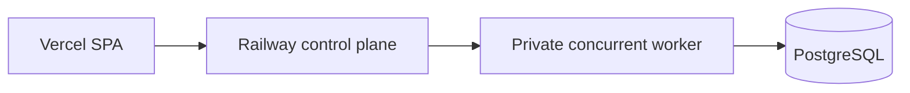

# Railway hosting test

The Vercel SPA proxies authentication and API requests to the public Railway
control plane. The concurrent worker and PostgreSQL have private endpoints.

Both application services build `runtime/Dockerfile` from the repository root
and start `/app/runtime/entrypoint.sh`. Readiness uses `/readyz` with a 300-second
timeout. Each has a `/data` volume and a 1 vCPU / 1 GB cap. These are starting
limits for low-volume testing, not a measured production capacity guarantee.

The control plane uses `WORKLIN_RUNTIME_MODE=control-plane`, disables automatic
Railway provisioning, and points `WORKLIN_CONCURRENT_RUNTIME_GATEWAY_URL` at the
worker's actual private DNS name on port 8080. Renaming a Railway service does
not rename its private DNS entry. Readiness accepts an enabled concurrent
runtime configuration without requiring automatic per-assistant provisioning.

The worker uses `WORKLIN_RUNTIME_MODE=concurrent_service`,
`RUNTIME_ASSISTANT_SCOPE_MODE=tenant_context`, one concurrent turn, and at most
five database connections. The internal signing key is shared with the control
plane. Store all credentials in Railway variables, never in the checkout.

The control plane uses the public Vercel application origin for Auth0 callbacks.
The three `VITE_*_API_BASE_URL` settings and the backend rewrites in
`vercel.json` must identify the same backend. Environment changes require a new
Vercel build. Build with `--archive=tgz` when using the CLI to avoid exceeding
the per-file upload limit on this monorepo. Keep `--skip-domain` until backend
health and authentication bootstrap checks pass, then promote the deployment.

## Rollout boundaries

- `WORKLIN_CONCURRENT_RUNTIME_MODE=internal` restricts concurrent routing to
  explicitly allowlisted assistant or user IDs. It does not enable all users.
- The workspace usage warning is $15 and the configured hard usage limit is
  $20. This cutoff can interrupt services. Usage caps are not a fixed-price
  quote and do not include separate model-provider charges or applicable taxes.
- PostgreSQL is fresh; this hosting test does not migrate existing user data.
- Retention, outbound campaigns, and browser-broker operations are not enabled
  by this three-service profile. The full VPS profile includes additional
  retention components; those require a separate Railway deployment and test.
- Application and migration database roles must be separated, RLS isolation
  verified, and backup/restore and concurrent-runtime release gates completed
  before a broad production rollout. See
  `docs/concurrent-runtime-service.md`.

## Verification

Run the focused control-plane readiness tests and typecheck before deployment.
Verify both Railway service deployments report success, the backend `/readyz`
returns HTTP 200, and authentication bootstrap responds through the Vercel
proxy. A passing healthcheck alone does not prove login, chat, retention, or
durable-job execution end to end.
