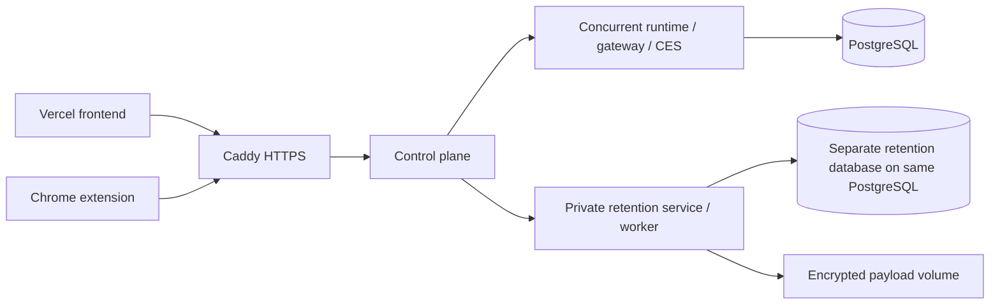

# Single-VPS deployment

This directory is a deployment profile for the complete VPS stack. It is not a
worker package: the same profile starts the public control-plane backend, the
private concurrent runtime, the retention worker, storage, and the HTTPS proxy.

> **Budget status:** this profile implements the
> [additional-$20 single-VPS plan](../../plans/runtime-architecture/twenty-dollar-single-vps-plan.md).
> Keeping the existing Vercel frontend is intentional and its current bill is
> outside the incremental cap. Provider purchase and production cutover remain
> pending.

The initial VPS profile keeps the web application on Vercel and runs the public
control plane, private concurrent runtime (gateway, assistant, CES), retention
service/worker, PostgreSQL, and Caddy HTTPS proxy on one Linux x86-64 VPS.
The required starting size is 4 shared vCPU, 8 GB RAM, and 80 GB disk. The
preflight script rejects hosts below 7 GB detected memory or 60 GB filesystem
capacity. This is a pilot target, not a verified capacity guarantee. Build the
runtime images separately; do not spend production memory compiling them during
live traffic.



Only ports 80 and 443 are published. SSH remains host-managed. PostgreSQL and
runtime ports have no host mappings. Service-local state uses named volumes;
the existing runtime image enforces its bundled Unix-user ownership boundaries.
This does not strengthen that image into separate container isolation between
the assistant, gateway and CES. No Docker socket or privileged container is used.

Retention, chat and the scoped extension broker are enabled. Brand archiving
remains disabled. Retention runs its existing service and worker; enabling it
does not implement missing connectors or add retention tools to concurrent chat.
Campaign sends and external writes remain disabled until their production gates
pass. Dedicated-runtime features
(workspace tools, shell, channels, voice and schedules) are not supplied by the
concurrent tier. See ../../docs/concurrent-runtime-service.md for its contract
and production release gates. The one-turn limit is an initial canary setting,
not evidence that the broader production load gates have passed.

## Configuration before deployment

Use a fresh VPS and fresh database; do not copy Railway data. Do not run this
profile against the existing production Compose volumes. Keep the existing
`deploy/production/docker-compose.yml` for its existing deployment consumers.

Prepare `/etc/worklin-vps` on the server, outside the repository, readable only
by the administrator. Store a completed `deployment.env.example` there as
`deployment.env`. Resolve official PostgreSQL 17 and Caddy images to exact tags
plus `@sha256:` digests; empty image inputs deliberately prevent deployment.
Use the source commit as WORKLIN_RELEASE. Add these separate secret env files:

Blank templates are in `examples/`. Fill private copies outside the checkout;
never enter real secrets into the committed examples.

| File | Required entries |
| --- | --- |
| `control-plane.env` | `WORKLIN_WEB_ORIGIN`, `WORKLIN_API_ORIGIN`, `WORKLIN_SESSION_SECRET`, `ACTOR_TOKEN_SIGNING_KEY`, `AUTH0_ISSUER_BASE_URL`, `AUTH0_CLIENT_ID`, `AUTH0_CLIENT_SECRET`, `AUTH0_SECRET`, `WORKLIN_RETENTION_SERVICE_JWT_SECRET`, `WORKLIN_RETENTION_SERVICE_WEBHOOK_SECRET`, `WORKLIN_RETENTION_GATEWAY_INGRESS_SECRET` |
| `concurrent-runtime.env` | `ACTOR_TOKEN_SIGNING_KEY`, `CONCURRENT_RUNTIME_DATABASE_URL`, `CONCURRENT_RUNTIME_MANAGED_PROVIDER`, provider API key; optionally `CONCURRENT_RUNTIME_MANAGED_MODEL` |
| `postgres.env` | `POSTGRES_PASSWORD`, `WORKLIN_DB_RUNTIME_PASSWORD`, `WORKLIN_DB_MIGRATOR_PASSWORD`, `WORKLIN_RETENTION_DB_RUNTIME_PASSWORD`, `WORKLIN_RETENTION_DB_MIGRATOR_PASSWORD` |
| `migrator.env` | `CONCURRENT_RUNTIME_MIGRATION_DATABASE_URL` |
| `retention.env` | `DATABASE_URL`, shared retention JWT/webhook secrets, separate 64-hex encryption key, `WORKLIN_RETENTION_PAYLOAD_STORE=filesystem`, and `WORKLIN_RETENTION_PAYLOAD_DIRECTORY=/data/retention-objects` |
| `retention-migrator.env` | `WORKLIN_RETENTION_MIGRATION_DATABASE_URL` |

Use the same freshly generated 64-hex actor signing key in the control plane
and runtime. Use distinct random secrets for other purposes. Database URLs use
host `postgres`, port `5432`, database `worklin`, and respectively the
`worklin_runtime` and `worklin_migrator` roles. URL-encode passwords (random hex
passwords avoid encoding ambiguity). Do not give the runtime the migrator or
PostgreSQL administrator credential. Do not copy a Railway environment file;
leave its provisioner keys absent so no remote resources can be allocated.

Retention uses database `worklin_retention` on `postgres:5432`, with separate
`worklin_retention_runtime` and `worklin_retention_migrator` roles. Match JWT and
webhook secrets between the control plane and retention, but keep the ingress
secret and encryption key distinct. The migration job gets only its database
credential, never payload or encryption credentials.

The retention service stores already-encrypted payload envelopes on the dedicated
`retention-objects` volume. Its filesystem adapter uses restrictive permissions,
atomic replacement, reference validation, and a write/delete readiness probe.
Preserve the encryption key outside the server as well as in encrypted backups;
the volume is unusable without it. S3 remains the default for existing retention
deployments and can be selected explicitly outside this VPS profile.

Keep the canonical Vercel frontend as WORKLIN_WEB_ORIGIN. Set WORKLIN_API_ORIGIN
to the new HTTPS API hostname. Review Auth0 callback/logout allowlists against
the existing same-origin Vercel proxy flow before switching traffic.

## Bring-up

Install Docker Engine with Compose on the VPS. Point the API DNS record at the
server and allow inbound TCP 80/443; restrict SSH to operator access. The proxy
obtains certificates automatically. Install `age` for encrypted backups. Run the
resource check and configuration validation from the checkout root:

```sh
bash deploy/vps/preflight.sh
docker compose --env-file /etc/worklin-vps/deployment.env -f deploy/vps/compose.yml config --quiet
docker compose --env-file /etc/worklin-vps/deployment.env -f deploy/vps/compose.yml up -d
docker compose --env-file /etc/worklin-vps/deployment.env -f deploy/vps/compose.yml ps -a
```

Build the two Worklin images on CI or a development build host from a clean
checkout at the exact `WORKLIN_RELEASE`. The build script requires a full commit,
builds both images, exports them together, and records their image IDs and bundle
checksum:

```sh
bash deploy/vps/build-images.sh \
  /etc/worklin-vps/deployment.env \
  /secure/build-output
```

Transfer the bundle and manifest, verify the SHA-256 value, then load it on the
VPS with `gzip -dc <bundle> | docker load`. Confirm the loaded image IDs match
the manifest before `up -d`. The Compose `build` definitions remain available
for development and emergency recovery, but normal production deployment does
not build on the VPS.

The PostgreSQL init script creates non-bypass runtime and migrator roles only
on an empty volume, including retention's isolated database. Both one-shot
migration jobs apply existing append-only migrations and grant runtime access
without table ownership or DDL privileges. On upgrades, stop each affected
service and rerun its migration job before restarting it. An already initialized
volume will not rerun the init script: provision any missing database/roles
explicitly with an administrator, never delete the volume to force initialization.
Never print resolved Compose configuration without `--quiet` around secrets.

## Acceptance and cutover

1. Verify migrations completed, role privileges and forced RLS, then private
   and public readiness. Test two tenants for isolation.
2. Update the existing Railway rewrite destinations in `vercel.json` only
   after the real VPS hostname is healthy. Align Vercel API variables and
   Auth0 URLs, then deploy the frontend. No placeholder hostname is committed
   into the live frontend configuration by this profile.
3. Create a fresh assistant, stream chat, cancel and reconnect, then test
   extension commands on example.com, takeover, resume and replay handling.
4. Restart containers and confirm conversations, sessions and credentials
   survive. Measure idle and peak memory, disk growth and queue latency.
5. Before real users, configure and verify the coordinated encrypted backup
   procedure below. Test restoring it to an isolated stack.
6. Follow [retention release gates](../../docs/retention-service-production-runbook.md):
   verify migrations, forced-RLS separation, encrypted file round-trip and
   deletion, signed ingress/replay handling, worker leases, and backup/restore.
   Connect test Shopify/Klaviyo accounts and verify ingestion before claiming
   those flows work. Keep provider webhook ingress, assistant bridge, external
   writes and campaign sends gated until their applicable tests pass. The
   concurrent tier does not supply the dedicated assistant retention bridge.

## Encrypted backup and verification

Enable the provider's seven-slot automatic server backup option. It covers the
whole failure domain but remains with the VPS provider, so also create the
coordinated application backup below and copy it to an approved location after
each run.

Generate an age identity on an operator machine. Keep the identity file off the
VPS and place only its public recipient in `/etc/worklin-vps/backup-recipients`.
Install `age` and use a root-owned backup directory. The backup command briefly
stops all writers, dumps both PostgreSQL databases, archives the closed SQLite,
runtime/CES, and encrypted-payload volumes, encrypts every artifact, records
checksums, and starts the services again even after a failure:

```sh
sudo bash deploy/vps/backup.sh \
  /etc/worklin-vps/deployment.env \
  /var/backups/worklin \
  /etc/worklin-vps/backup-recipients \
  /etc/worklin-vps
```

Copy the resulting `worklin-<UTC timestamp>` directory off the VPS. On an
isolated restore host with the age identity and PostgreSQL client installed,
verify it before restoration:

```sh
bash deploy/vps/verify-backup.sh \
  /path/to/worklin-<UTC timestamp> \
  /secure/path/to/worklin-backup-identity.txt
```

Restore only into fresh empty Compose volumes and empty databases. Decrypt the
three volume archives into their matching named volumes while application
services are stopped. Restore the two custom-format dumps with `pg_restore`
through the PostgreSQL administrator, rerun runtime grants, start internal
services, and complete the two-tenant, credential, payload deletion, and browser
acceptance checks before declaring the restore usable. Never restore over a live
volume.

Do not run `docker compose down -v`; that destroys persistent state. Keep
previous images and Vercel routing available for rollback; database migration
compatibility must be checked before rolling back an image.

Retention is part of this profile, not a claim of a verified live deployment.
A Vercel-only backend refactor is deferred.
No server purchase, DNS change or production traffic cutover is performed by
adding these files. Provisioning still needs the VPS, DNS, image digests and the
above credentials; service health, a real backup restore, Vercel rewrites, and
browser acceptance remain untested until that deployment exists.
