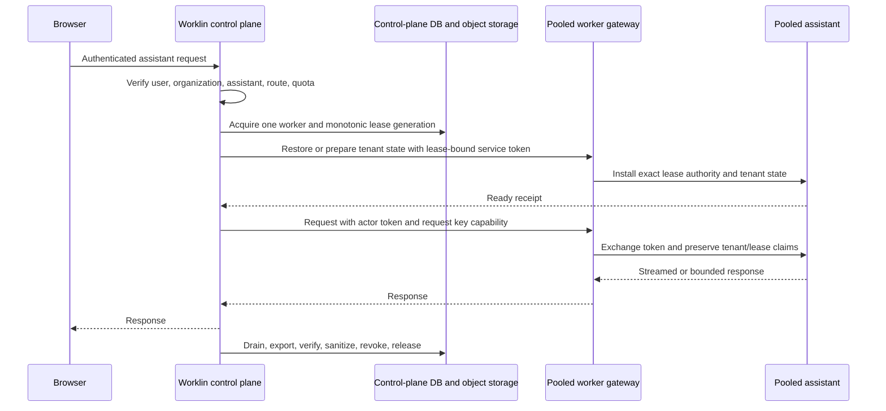

# Pooled Runtime Workers

Pooled runtime workers let platform-hosted assistants share a bounded compute
fleet without sharing an active tenant workspace. The pool is disabled by
default. Dedicated runtime routing remains unchanged unless every pool startup
gate is enabled and healthy.

This design is not a shared assistant. A worker has at most one active tenant
lease, one immutable worker identity, and one monotonically increasing lease
generation. Reassignment is permitted only after the previous tenant has been
drained, exported, sanitized, and deauthorized.

## Request Flow



The control plane authenticates ownership before considering the pool.
Assistants with an active dedicated runtime continue to use it. Only a
resource-free hosted assistant can enter the pooled route.

Concurrent requests for the same tenant and assistant coalesce onto the same
lease. Requests for unrelated assistants coordinate independently. Each worker
advertises `maxConcurrentLeases: 1`; the global concurrency limit cannot exceed
the number of catalogued workers.

## Tenant and Lease Authority

Every actor and service token used by a pooled worker carries:

- organization, user, assistant, and actor identity;
- immutable worker stack ID;
- monotonic lease generation;
- lease expiry and request ID.

The gateway persists the active lease authority in an atomic, non-symlinked
file shared read-only with the assistant process. The production image creates
its parent as `gateway:vellum` with mode `2750`, so the gateway can replace the
file and the assistant can verify it. The assistant rereads the file for every
authorization decision. A released, expired, wrong-worker, or older-generation
token fails closed.

The control plane also keeps a request handle for every routed request. A lease
cannot enter release while another handle for that tenant remains active.
Restarted control-plane processes quarantine persisted leases; an operator must
present the exact binding to run the full cleanup sequence before reuse.

The pooled coordinator itself holds a separate singleton database ownership
lease. Its row binds a unique process owner to Railway's deployment and replica
IDs and a monotonic coordinator epoch. Acquisition uses an immediate database
transaction, renewal and release use exact compare-and-swap conditions, and a
second process cannot coordinate the pool until the live owner releases or its
TTL expires. Every new route, worker service token, and model-key capability
requires the current epoch to remain live before and after issuance.

If the coordinator heartbeat loses ownership, the process immediately stops
advertising pooled assistants as active, rejects new pooled routes, aborts
registered upstream HTTP requests, and revokes in-process model-key
capabilities. Existing worker leases remain bound and quarantined for exact
operator recovery; ownership loss never makes an unsanitized worker reusable.

## State Lifecycle

Tenant workspace state is stored as a tenant- and generation-scoped object.
The production lifecycle is:

1. Verify the worker is registered, healthy, idle, and not quarantined.
2. Acquire a database lease with a new generation.
3. Verify the prior object metadata and checksum, then restore it; or prepare an
   explicitly empty assignment.
4. Activate interactive request handling only after restore succeeds.
5. Fence new work and wait for conversations, tools, streams, voice sessions,
   timers, processes, and assignment-bound caches to reach zero.
6. Export a redacted state bundle, upload through a signed object-storage URL,
   and verify its metadata and checksum.
7. Sanitize the worker workspace and process-local tenant state.
8. Revoke gateway/assistant lease authority.
9. Release the database lease with an exact compare-and-swap.

Credentials, gateway security state, CES state, raw provider keys, and runtime
authority files are excluded from state bundles. Any failed restore, export,
verification, sanitization, or revocation quarantines the worker instead of
making it available to another tenant. If lifecycle lease renewal becomes
ambiguous after restore, export, sanitization, or revocation has touched the
worker, the exact generation is also quarantined and remains bound until
explicit operator cleanup.

### Workspace quotas and state-object limits

The control plane is authoritative for each tenant's workspace quota. It
resolves the quota only after authenticating the exact organization, user,
assistant, worker, and lease generation, then includes that server-side value
in restore, empty-prepare, and export requests. A browser or worker cannot
select or raise its own quota.

The worker installs that quota as assignment-scoped state during restore or
empty preparation and clears it during assignment reset. Pooled `file_write`
and `file_edit` operations measure the same exportable workspace manifest and
reject a mutation before touching disk when its exact projected uncompressed
size would exceed the quota. Repeated small writes are therefore cumulative;
an edit is charged for the new size minus the replaced file's old size.

Export performs a final exact manifest scan. `workspace_bytes` is the sum of
the uncompressed bytes in that manifest; it is stored independently from the
compressed state object's `byte_size`. An over-quota workspace is not uploaded,
and the lease is quarantined. Restore enforces the object cap before download,
enforces the uncompressed quota while importing, and verifies the restored
manifest against the checkpoint's known `workspace_bytes`. Generation zero is
an explicit empty workspace with `workspace_bytes = 0`. Older checkpoints may
temporarily have a null value; a trusted restore backfills it after an exact
scan.

The compressed-object ceiling must cover the largest configured tenant quota
plus a narrow archive overhead. The default overhead is 64 MiB. Pool startup
fails if `WORKLIN_RUNTIME_WORKER_STATE_MAX_OBJECT_BYTES` is smaller than any
configured tenant quota plus
`WORKLIN_RUNTIME_WORKER_STATE_ARCHIVE_OVERHEAD_BYTES`, or if it exceeds the
worker hard limit. Do not treat archive compression as additional tenant
storage allowance.

## Model Credentials

Pooled model-provider keys are stored in an encrypted control-plane vault, not
in a worker workspace or worker environment. Encryption is tenant-bound and
requires a stable server-side master key.

For an active request, the control plane mints a short-lived capability bound
to the tenant, worker, lease generation, and request handle. The capability is
stripped before application route handlers run. The assistant may resolve a
supported provider key only inside that authenticated request scope. Completion,
cancellation, expiry, reassignment, or capability revocation aborts outstanding
lookups and prevents the value from escaping the request.

Renderer-facing secret routes never return plaintext provider keys. Worker-local
credential CRUD and reveal routes are not available in pooled mode. The current
`POST /v1/secret` body can request persistent worker-local storage, so pooled
workers reject the entire route. Secret prompts require a dedicated runtime
until a distinct transient-send-only contract is enforced at the control-plane
boundary.

Provider-key creation, rotation, and deletion are serialized through the same
per-tenant queue as worker routing. A configuration mutation is rejected while
request handles are active. An idle warm worker is fully exported, sanitized,
and deauthorized before validation or vault mutation begins, and routing cannot
reacquire it until the mutation finishes. This prevents a warm worker's
provider profile from outliving the control-plane key configuration.

## Supported Surface

The route policy is pinned to the assistant route inventory and an exact
method/endpoint allowlist. Route parameters match one canonical segment; there
are no prefix or wildcard grants. Unknown route families and every known route
not explicitly reviewed fail closed. The inventory test also prevents an
unreviewed static handler from being admitted through an allowed parameterized
route.

Pooled v1 supports bounded interactive HTTP requests, transcript polling, and
confirmation and question responses. Message responses send whitespace
heartbeats before the final JSON body so browser and proxy timeouts do not
release the worker while an approval is pending. The turn still has a hard
deadline.

The following remain on dedicated runtimes or return unavailable:

- indefinite assistant event streams;
- terminal and ACP sessions;
- background schedules, workflows, subagents, and wake routes;
- task/work-item execution (template and queue CRUD remain available);
- direct credential storage/reveal operations and worker-local secret-prompt
  delivery;
- auxiliary inference and maintenance routes such as BTW sidechains,
  conversation analysis/regeneration, playground compaction, memory
  backfills/reindexing, global federated/semantic search, document PDF
  rendering, and long-wait interactive UI requests;
- app import/open/compile/publish/share and skill mutation or executable
  inspection (reviewed app data/preview/history and static skill reads remain
  available);
- contact, client-device, guardian-account bootstrap, and disk-pressure
  control surfaces;
- worker-side provider/model configuration mutations; provider API-key BYOK is
  configured through the control-plane vault;
- OAuth, email, external-integration, notification, Slack, webhook, and plugin
  management routes until those stores are tenant-scoped;
- ChatGPT subscription authentication (pooled v1 accepts provider API-key BYOK
  only);
- all live-voice bootstrap, session, WebSocket, and provider-callback routes;
  pooled workers do not receive voice-provider credentials, and those routes
  remain unavailable until credentials and callbacks are tenant- and
  generation-bound in the control plane;
- telephony, recording sessions, and streaming dictation.

## Activation

All control-plane gates must be enabled together:

```text
WORKLIN_TENANT_RUNTIME_ADMISSION_ENABLED=true
WORKLIN_TENANT_RUNTIME_OPERATIONS_ENABLED=true
WORKLIN_TENANT_STORAGE_QUOTA_ENFORCEMENT_ENABLED=true
WORKLIN_TENANT_USAGE_METRICS_ENABLED=true
WORKLIN_TENANT_IDLE_SUSPENSION_ENABLED=true
WORKLIN_RUNTIME_CAPACITY_ALERTS_ENABLED=true
WORKLIN_TENANT_STORAGE_QUOTA_BYTES=<default uncompressed workspace quota>
WORKLIN_RUNTIME_WORKER_STATE_ARCHIVE_OVERHEAD_BYTES=<archive overhead; default 67108864>
WORKLIN_RUNTIME_WORKER_STATE_MAX_OBJECT_BYTES=<at least largest tenant quota plus overhead>
WORKLIN_RUNTIME_WORKER_CATALOG_ENABLED
WORKLIN_RUNTIME_WORKER_CATALOG_JSON
WORKLIN_RUNTIME_WORKER_POOL_ENABLED
WORKLIN_RUNTIME_WORKER_POOL_STACK_IDS
WORKLIN_RUNTIME_WORKER_POOL_MAX_CONCURRENCY
WORKLIN_RUNTIME_WORKER_POOL_LEASE_TTL_MS
WORKLIN_CONTROL_PLANE_EXPECTED_REPLICA_COUNT=1
RAILWAY_DEPLOYMENT_ID=<injected by Railway>
RAILWAY_REPLICA_ID=<injected by Railway>
WORKLIN_RUNTIME_WORKER_COORDINATOR_OWNERSHIP_TTL_MS=<optional; default 15000>
WORKLIN_RUNTIME_WORKER_COORDINATOR_HEARTBEAT_MS=<optional; default 5000>
WORKLIN_RUNTIME_WORKER_OPERATOR_RECOVERY_TOKEN
WORKLIN_RUNTIME_WORKER_PRODUCTION_TRANSPORT_ENABLED
WORKLIN_RUNTIME_WORKER_STATE_PROVIDER=gcs
WORKLIN_RUNTIME_WORKER_STATE_BUCKET
WORKLIN_RUNTIME_WORKER_STATE_GCS_SERVICE_ACCOUNT_JSON
WORKLIN_RUNTIME_WORKER_STATE_SIGNED_URL_TTL_SECONDS
WORKLIN_RUNTIME_WORKER_STATE_REQUEST_TIMEOUT_MS
WORKLIN_RUNTIME_WORKER_HEALTH_PROBE_ENABLED
WORKLIN_RUNTIME_WORKER_HEALTH_PROBE_TIMEOUT_MS
WORKLIN_POOLED_MODEL_KEY_VAULT_ENABLED
WORKLIN_POOLED_MODEL_KEY_VAULT_MASTER_KEY
ACTOR_TOKEN_SIGNING_KEY
```

For a Railway Storage Bucket, replace the GCS provider/credential variables
with:

```text
WORKLIN_RUNTIME_WORKER_STATE_PROVIDER=s3
BUCKET=<Railway bucket BUCKET>
ACCESS_KEY_ID=<Railway bucket ACCESS_KEY_ID>
SECRET_ACCESS_KEY=<Railway bucket SECRET_ACCESS_KEY>
REGION=<Railway bucket REGION, normally auto>
ENDPOINT=<Railway bucket ENDPOINT, normally https://storage.railway.app>
WORKLIN_RUNTIME_WORKER_STATE_S3_URL_STYLE=virtual
```

The equivalent `WORKLIN_RUNTIME_WORKER_STATE_S3_*` variables take precedence
over Railway's short variable names. Use `path` instead of `virtual` only when
the bucket Credentials tab explicitly identifies an older path-style bucket.
The control plane is the only service that receives access or secret keys.

Each worker service uses:

```text
WORKLIN_RUNTIME_MODE=pooled_worker
WORKLIN_RUNTIME_WORKER_STACK_ID=<catalog worker ID>
WORKLIN_CONTROL_PLANE_INTERNAL_URL=http://<control-plane>.railway.internal:<private port>
WORKLIN_RUNTIME_WORKER_STATE_TRANSPORT_ENABLED=true
WORKLIN_RUNTIME_WORKER_STATE_PROVIDER=<gcs or s3>
WORKLIN_RUNTIME_WORKER_STATE_BUCKET=<same tenant-state bucket configured in the control plane>
WORKLIN_RUNTIME_WORKER_STATE_S3_ENDPOINT=<S3 only; same non-secret ENDPOINT metadata>
WORKLIN_RUNTIME_WORKER_STATE_S3_REGION=<S3 only; same non-secret REGION metadata>
WORKLIN_RUNTIME_WORKER_STATE_S3_URL_STYLE=<S3 only; virtual or path>
ACTOR_TOKEN_SIGNING_KEY=<64-hex key derived for runtime_v1:<catalog worker ID>>
```

Never link bucket credentials into a worker. Workers receive only the provider,
bucket, endpoint/region/style metadata, and one exact short-lived signed object
URL per export, restore, or verification operation. They reject redirects,
non-HTTPS storage endpoints, signature-field drift, and URLs outside the
authenticated tenant-generation path.

The production entrypoint forces the pooled tenant workspace to
`/data/workspace` and the gateway IPC directory to
`/run/worklin-runtime-ipc`, verifies that they do not overlap, and derives
`WORKLIN_RUNTIME_WORKER_LEASE_AUTHORITY_FILE` beneath it. A different pooled
workspace, IPC, or authority path is rejected. This keeps the live gateway
socket and lease authority outside the workspace tree that is recursively
sanitized between tenants. A pooled worker does not start without its worker
ID, durable-state configuration, explicit private control-plane URL, or
worker-derived actor-signing key. The control plane retains the master actor
signing key; it must never be copied into a worker. The catalog gateway URL
must be a private service origin; Railway private HTTP is permitted only for an
exact `.railway.internal` host.

Startup registers only inert pooled rows, probes every declared worker, checks
catalog order and capacity, requires durable state transport and the encrypted
key vault, acquires the singleton coordinator epoch, and activates only when
every worker is green. The operator recovery token is a distinct 32-512
character opaque secret; it must not reuse a user, provider, session, or actor
token. Partial enablement, replica-count drift, coordinator contention,
identity drift, a failed health probe, or missing durable dependencies aborts
startup. A failed startup releases its exact coordinator epoch before exit.

## Operational Constraints

Pooled v1 requires an explicit expected control-plane replica count of one
because active request capabilities and upstream abort controllers are
process-local. Railway deployment and replica IDs are mandatory when the pool
is enabled. The database ownership lease rejects an accidental concurrent
replica even if deployment scaling drifts, but it is a safety fence rather than
a multi-replica coordinator. Supporting multiple active control-plane replicas
still requires a shared grant/request registry and distributed request
coordination. Before recovering a persisted restart lease, the operator must
first verify that the previous control-plane process has terminated; the
cleanup-only lease is a fencing mechanism for a confirmed restart.

The control-plane database must use persistent storage. The vault master key
must remain stable; a changed key fails startup. Key rotation requires an
offline re-encryption operation. Runtime state requires an object-storage
bucket and signing service account.

The authenticated operator recovery endpoint is
`/internal/v1/runtime-workers/operator-recovery`. `GET` lists exact
generation-bound recovery candidates without lease tokens. `POST` accepts
either `release_restart_lease` or `discard_quarantined_state`. The discard
action additionally requires the literal confirmation
`DISCARD_UNCHECKPOINTED_RUNTIME_STATE`; it sanitizes and revokes the physical
worker, preserves the last durable checkpoint object and generation, and
discards only uncheckpointed live state. Ordinary tenant traffic cannot invoke
either path and never routes through a cleanup-only recovery lease.

Before external beta traffic:

1. Deploy the code with every pool gate disabled.
2. Create a new worker service; do not repurpose a customer-bound runtime.
3. Confirm private networking, persistent control-plane storage, object
   storage, and stable secrets.
4. Enable one catalogued worker with global concurrency `1`.
5. Run two tenants sequentially through the same worker.
6. Verify tenant B receives none of tenant A's IDs, key material, messages,
   state markers, object paths, files, approvals, browser state, or voice state.
7. Replay tenant A's actor, service, and model-key capabilities after cutover
   and require rejection.
8. Test restart quarantine and exact operator recovery.
9. Expand capacity only after the same canary passes for every worker.
