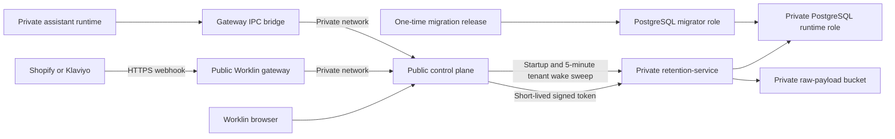

# Retention Service Production Runbook

## Purpose

`retention-service` is Worklin's private, tenant-isolated customer decisioning
data service. It stores normalized customer evidence, decisions, campaign
state, approvals, usage, dispatch intent, and immutable audit records.

This runbook covers the production deployment that exists in this repository.
It is intentionally fail closed. A green deployment proves that the process,
database isolation, migration, and raw-payload bucket are ready. It does not
prove that Shopify/Klaviyo backfills, polling, AI generation, or outbound
delivery are complete.

Production posture at this revision:

- Deploy privately with external writes and sending disabled.
- Permit verified read-only webhook ingestion only after the infrastructure,
  isolation, backup, restore, and synthetic-tenant gates pass.
- Do not enable customer sends. There is no outbound Klaviyo delivery worker.
- Do not place customer data in production until every prerequisite below is
  recorded as passed.

## Ownership Of Truth

- Shopify is commerce truth.
- Klaviyo is delivery and operational-event truth.
- Worklin is customer-intelligence, audience, decision, approval, and campaign
  truth.
- Klaviyo segments are neither imported nor created by this service.

## Production Topology



The browser and providers must never call `retention-service` directly.
`retention-service` must not have a Railway public domain. Put the gateway,
control plane, retention service, PostgreSQL, and bucket in the same Railway
project and environment. Railway private DNS is scoped to one project and
environment, and internal service calls use
`http://<service>.railway.internal:<port>`.

The service binds to `::` by default. Keep that setting because it supports both
current dual-stack Railway environments and legacy IPv6-only private networks.

Railway references:

- [Private networking](https://docs.railway.com/private-networking)
- [Private and public domains](https://docs.railway.com/networking/domains/working-with-domains)
- [Storage buckets](https://docs.railway.com/storage-buckets)
- [Deployment healthchecks](https://docs.railway.com/deployments/healthchecks)
- [PostgreSQL point-in-time recovery](https://docs.railway.com/volumes/point-in-time-recovery)

## Non-Negotiable Production Gates

Record evidence for every item before ingesting customer data:

- A dedicated production Railway environment exists.
- `retention-service` has private networking only and no public domain.
- PostgreSQL is dedicated to retention data or has an equivalently isolated
  database and schema.
- Automated database backups are enabled.
- PostgreSQL point-in-time recovery is enabled and its first base backup has
  completed.
- A restore drill to a separate service has succeeded.
- The migrator and runtime database roles are separate.
- The runtime role is not a superuser, cannot bypass RLS, and owns no
  `retention_%` table.
- The migrator is not a superuser and cannot bypass RLS.
- Migration `001_initial` is applied.
- Runtime grants have been applied after the migration.
- `/readyz` returns `200` with `tenantIsolation: "ready"`.
- Empty-database migration, tenant-isolation SQL, and the real PostgreSQL
  operator flow pass using the non-bypass runtime role.
- Tenant initialization inserts its registry row inside an organization-scoped
  transaction.
- The control-plane wake sweep reaches one active binding per organization.
- The raw-payload bucket is private, isolated to production, and reachable.
- All shared secrets are distinct and stored only in Railway variables.
- Global external writes and sending are both `false`.
- Organization-level external writes and sending are both `false`.
- Gateway webhook ingress is initially disabled.
- Continuous monitoring exists outside Railway's deployment healthcheck.
- On-call ownership, incident contacts, and the organization kill-switch owner
  are recorded.

Railway's healthcheck is a deployment activation check, not continuous uptime
monitoring. A separate monitor must query the private service through a trusted
internal monitor or through a control-plane health aggregator.

## Railway Provisioning

### 1. Create The Private Service

Create a Railway service from the repository root and use:

- Config file: `railway.retention.json`
- Dockerfile: `retention-service/Dockerfile`
- Healthcheck path: `/readyz`
- Service port: `8080`
- Restart policy: on failure, up to 10 retries
- Public networking: disabled
- Private service name: use a stable name such as `retention-service`

The control plane should use this internal origin:

```text
http://retention-service.railway.internal:8080
```

Set it as `WORKLIN_RETENTION_SERVICE_URL` on the control plane. Do not use a
generated `*.up.railway.app` URL.

### 2. Provision PostgreSQL

Use a dedicated PostgreSQL service in the production environment. Keep its
public TCP proxy disabled after initial administration whenever Railway
operations permit it.

The service requires two database identities:

- Migrator: owns the retention schema objects and is used only by controlled
  migration releases.
- Runtime: used by every normal service instance. It cannot own tenant tables,
  bypass RLS, create schema objects, or assume the migrator role.

Do not use Railway's database owner URL as `DATABASE_URL`.

### 3. Provision The Raw-Payload Bucket

Create a production-only Railway bucket in the same environment. Railway
buckets are private S3-compatible storage. Use its S3 API bucket name (`BUCKET`),
not its display name (`RAILWAY_BUCKET_NAME`).

Map Railway bucket references to service variables:

| Service variable                                | Railway bucket value                                                                       |
| ----------------------------------------------- | ------------------------------------------------------------------------------------------ |
| `WORKLIN_RETENTION_BUCKET_ENDPOINT`             | `ENDPOINT`                                                                                 |
| `WORKLIN_RETENTION_BUCKET_NAME`                 | `BUCKET`                                                                                   |
| `WORKLIN_RETENTION_BUCKET_REGION`               | `REGION`                                                                                   |
| `WORKLIN_RETENTION_BUCKET_ACCESS_KEY_ID`        | `ACCESS_KEY_ID`                                                                            |
| `WORKLIN_RETENTION_BUCKET_SECRET_ACCESS_KEY`    | `SECRET_ACCESS_KEY`                                                                        |
| `WORKLIN_RETENTION_BUCKET_VIRTUAL_HOSTED_STYLE` | `true`; the service combines Railway's generic endpoint with the `BUCKET` hostname for Bun |

The application encrypts raw payloads before upload. Bucket privacy does not
replace application encryption. Do not expose presigned URLs for these objects.

Bucket versioning, independent replication, lifecycle expiration, and a
tested raw-payload restore/replay procedure are not implemented. Treat these as
rollout blockers for any retention promise that depends on indefinite replay.

## PostgreSQL Roles And Grants

### Role Requirements

Use generated, unique passwords stored in Railway secrets. Run the following
bootstrap through the Railway database administration identity. Substitute the
actual database and role names. The retention database should not contain
unrelated application tables.

```sql
REVOKE CREATE ON SCHEMA public FROM PUBLIC;
REVOKE TEMPORARY ON DATABASE worklin_retention FROM PUBLIC;

CREATE ROLE worklin_retention_migrator
  LOGIN
  PASSWORD '<generated-migrator-password>'
  NOSUPERUSER
  NOCREATEDB
  NOCREATEROLE
  NOINHERIT
  NOREPLICATION
  NOBYPASSRLS;

CREATE ROLE worklin_retention_runtime
  LOGIN
  PASSWORD '<generated-runtime-password>'
  NOSUPERUSER
  NOCREATEDB
  NOCREATEROLE
  NOINHERIT
  NOREPLICATION
  NOBYPASSRLS;

GRANT CONNECT ON DATABASE worklin_retention
  TO worklin_retention_migrator, worklin_retention_runtime;
GRANT USAGE, CREATE ON SCHEMA public TO worklin_retention_migrator;
GRANT USAGE ON SCHEMA public TO worklin_retention_runtime;
```

Do not grant membership between these roles. Do not grant the runtime role
`CREATE`, `TRIGGER`, `REFERENCES`, `TRUNCATE`, database ownership, schema
ownership, or ownership of any function.

### Apply Migrations

The current service supports startup migration through
`WORKLIN_RETENTION_RUN_MIGRATIONS=true` and requires a separate
`WORKLIN_RETENTION_MIGRATION_DATABASE_URL`.

Use a one-time, private migration release:

1. Clone the retention service configuration into a temporary migration
   service with no public domain.
2. Set both database URLs to the migrator URL for that temporary release.
3. Set `WORKLIN_RETENTION_RUN_MIGRATIONS=true`.
4. Keep both write kill switches `false`.
5. Start the release and wait for migrations `001_initial`,
   `002_privacy_workflows`, `003_program_policy_approvals`,
   `004_raw_payload_deletion_outbox`, `005_segment_review_pilot`, and
   `006_klaviyo_property_access_mode` to be recorded.
6. Stop the temporary migration service.
7. Apply the runtime grants below.
8. Deploy the normal service with the runtime URL.
9. Set `WORKLIN_RETENTION_RUN_MIGRATIONS=false`.
10. Remove `WORKLIN_RETENTION_MIGRATION_DATABASE_URL` from the normal service.

Never leave the migrator URL on a steady-state runtime service. The temporary
migration release may report unsafe tenant isolation because it connects as the
table owner; it must never receive traffic and must be stopped after migration.

There is no dedicated migration-only executable yet. The temporary release
procedure is the supported bridge until one exists.

The migrator must remain `NOSUPERUSER NOBYPASSRLS`. The migration contains no
cross-tenant `SECURITY DEFINER` function and does not require bypass privileges.

### Apply Runtime Grants

Run this after every migration. It grants runtime data access only to retention
tables, excludes the migration ledger from mutation, and grants only the
organization-context function used by forced-RLS policies.

```sql
REVOKE CREATE ON SCHEMA public FROM worklin_retention_runtime;
REVOKE ALL ON ALL FUNCTIONS IN SCHEMA public FROM PUBLIC;

GRANT USAGE ON SCHEMA public TO worklin_retention_runtime;
GRANT SELECT ON TABLE retention_schema_migrations
  TO worklin_retention_runtime;

DO $$
DECLARE
  tenant_table record;
BEGIN
  FOR tenant_table IN
    SELECT quote_ident(schemaname) AS schema_name,
           quote_ident(tablename) AS table_name
    FROM pg_tables
    WHERE schemaname = 'public'
      AND tablename LIKE 'retention_%'
      AND tablename <> 'retention_schema_migrations'
  LOOP
    EXECUTE format(
      'GRANT SELECT, INSERT, UPDATE, DELETE ON TABLE %s.%s TO worklin_retention_runtime',
      tenant_table.schema_name,
      tenant_table.table_name
    );
  END LOOP;
END
$$;

GRANT EXECUTE ON FUNCTION worklin_current_org_id()
  TO worklin_retention_runtime;
```

`REVOKE ALL ON ALL FUNCTIONS ... FROM PUBLIC` is safe only in a dedicated
retention database. If retention shares a database, replace it with explicit
revocation for `worklin_current_org_id()` and move retention into a dedicated
database before customer rollout.

The runtime currently needs broad row-level CRUD because the repository owns
the full data lifecycle. The immutable audit trigger rejects updates and
deletes to `retention_audit_events`. Future hardening should replace broad table
grants with per-table, per-operation grants.

### Verify Forced RLS

Migration `001_initial` enables and forces row-level security on every tenant
table. Each policy uses:

```sql
org_id = worklin_current_org_id()
```

for both row visibility and write checks. Repository operations set
`worklin.org_id` transaction-locally before accessing tenant rows. Without an
organization context, tenant reads return no rows and writes fail. Tenant
initialization performs the registry and organization-settings inserts inside
that same organization-scoped transaction.

Verify the production runtime role:

```sql
SELECT
  current_user,
  rolsuper,
  rolbypassrls
FROM pg_roles
WHERE rolname = current_user;

SELECT
  c.relname,
  c.relrowsecurity,
  c.relforcerowsecurity,
  pg_get_userbyid(c.relowner) AS owner
FROM pg_class AS c
JOIN pg_namespace AS n ON n.oid = c.relnamespace
WHERE n.nspname = 'public'
  AND c.relname LIKE 'retention_%'
ORDER BY c.relname;
```

Required result:

- `rolsuper = false`
- `rolbypassrls = false`
- every tenant table has RLS enabled and forced
- runtime role owns no `retention_%` table
- no organization context is present on a fresh runtime connection

Also run `retention-service/tests/tenant-isolation.sql` against the runtime
role before every production schema release. The test verifies no-context
failure, same-identifier isolation across two organizations, and tenant-scoped
registry inserts without privileged helper functions.

## Environment Configuration

Use `retention-service/.env.example` as the service variable inventory. The
file contains no usable secrets.

### Required Retention Service Variables

- `DATABASE_URL`: runtime-role PostgreSQL URL.
- `WORKLIN_RETENTION_SERVICE_JWT_SECRET`: shared only with the control plane;
  minimum 32 bytes.
- `WORKLIN_RETENTION_SERVICE_WEBHOOK_SECRET`: distinct HMAC secret shared only
  with the control plane; minimum 32 bytes.
- `WORKLIN_RETENTION_ENCRYPTION_KEY`: exactly 32 random bytes encoded as 64 hex
  characters.
- All five required bucket connection values.

### Control Plane Variables

- `WORKLIN_RETENTION_SERVICE_ENABLED=false` for the first deployment.
- `WORKLIN_RETENTION_SERVICE_URL` set to the private internal origin.
- `WORKLIN_RETENTION_SERVICE_JWT_SECRET` matching the service.
- `WORKLIN_RETENTION_SERVICE_WEBHOOK_SECRET` matching the service.
- `WORKLIN_RETENTION_SERVICE_TOKEN_TTL_SECONDS=30`.
- `WORKLIN_RETENTION_SERVICE_TIMEOUT_MS=10000`.
- `WORKLIN_RETENTION_SERVICE_MAX_BODY_BYTES=1048576`.
- `WORKLIN_RETENTION_GATEWAY_INGRESS_SECRET` matching the gateway.
- `WORKLIN_RETENTION_ASSISTANT_BRIDGE_ENABLED=true` when isolated assistant
  runtimes should use the central retention tools.
- `WORKLIN_CONTROL_PLANE_INTERNAL_URL` set to the control plane's private
  internal origin when the assistant bridge is enabled.

Enable `WORKLIN_RETENTION_SERVICE_ENABLED=true` only after `/readyz` passes and
the read-only rollout begins.

### Gateway Variables

- `WORKLIN_RETENTION_WEBHOOKS_ENABLED=false` initially.
- `WORKLIN_CONTROL_PLANE_INTERNAL_URL` set to the control plane's private
  internal origin.
- `WORKLIN_RETENTION_GATEWAY_INGRESS_SECRET` matching the control plane;
  minimum 32 bytes.

The gateway and control plane ingress secret is separate from both retention
service secrets.

### Isolated Runtime Bridge Variables

When `WORKLIN_RETENTION_ASSISTANT_BRIDGE_ENABLED=true` on the control-plane
provisioner, it injects these values into each isolated runtime gateway:

- `WORKLIN_RETENTION_ASSISTANT_BRIDGE_ENABLED=true`
- `WORKLIN_CONTROL_PLANE_INTERNAL_URL=<private-control-plane-origin>`
- `WORKLIN_RETENTION_GATEWAY_INGRESS_SECRET=<shared-gateway-ingress-secret>`
- `PLATFORM_ORGANIZATION_ID=<runtime-organization-uuid>`
- `WORKLIN_PLATFORM_ASSISTANT_ID=<runtime-assistant-id>`

The gateway accepts assistant retention IPC only when the requested
organization and assistant exactly match the two injected platform identity
values. It forwards only an explicit allowlist of status, campaign preparation,
decision, audience, and message routes. Integration management, access grants,
campaign approval, release, and sending are not assistant-bridge routes.

These variables belong on the control-plane provisioner and isolated runtime
gateway. They are not read by the `retention-service` process itself.

## Secrets And Rotation

### Secret Inventory

| Secret                               | Present in                             | Rotation state                          |
| ------------------------------------ | -------------------------------------- | --------------------------------------- |
| Service JWT secret                   | Control plane, retention service       | Coordinated rotation; one active key    |
| Internal webhook HMAC secret         | Control plane, retention service       | Coordinated rotation; one active key    |
| Gateway ingress secret               | Gateway, control plane                 | Coordinated rotation; one active key    |
| Encryption key                       | Retention service                      | No online rotation/key versioning       |
| Runtime database password            | Retention service, PostgreSQL          | Rotatable with a new runtime credential |
| Migrator database password           | One-time migration release, PostgreSQL | Rotate after each migration window      |
| Bucket access key                    | Retention service, bucket              | Reset invalidates the old credential    |
| Provider credentials/webhook secrets | Encrypted retention records            | No update/rotation operator API yet     |

Rules:

- Never reuse a secret across rows in this table.
- Never place secret values in Git, logs, issue trackers, screenshots, or
  command history.
- Restrict production variable access to named infrastructure operators.
- Record rotation time, operator, affected deployment, and verification in the
  security audit system.
- Remove migration credentials immediately after the migration window.

### Shared-Secret Rotation

The service accepts one JWT key and one internal webhook HMAC key at a time.
There is no dual-key overlap.

For either key:

1. Keep external writes and sending disabled.
2. Pause webhook ingress when rotating the webhook HMAC key.
3. Generate a new independent secret.
4. Update the retention service and its peer in one maintenance window.
5. Deploy the verifier first, then the signer.
6. Expect fail-closed `401` or `403` responses during the short mismatch.
7. Verify operator requests or a signed test webhook.
8. Remove the old value from Railway history where supported.

The default actor-token lifetime is 30 seconds, which bounds stale JWT use
after a coordinated rotation.

### Encryption-Key Rotation

Do not replace `WORKLIN_RETENTION_ENCRYPTION_KEY` in place. Existing
ciphertexts are not versioned and would become unreadable. Production
encryption-key rotation requires a keyring, ciphertext key versions, a
re-encryption job, progress checkpoints, and rollback support. This is an
explicit blocker before routine customer operation.

### Bucket Credential Rotation

Bucket credential reset invalidates the previous credentials:

1. Disable webhook ingress and stop the retention worker.
2. Reset the bucket credential.
3. update all five bucket variables.
4. Redeploy and require `/readyz` to report
   `rawPayloadStore: "ready"`.
5. Re-enable webhook ingress only after a write/read/delete canary succeeds.

## Health, Readiness, And Migrations

### `GET /healthz`

Returns `200` when the HTTP process is alive. It does not check dependencies
and must not be used for traffic activation.

### `GET /readyz`

Returns `200` only when all of these are true:

- PostgreSQL accepts queries.
- Migration `001_initial` is recorded.
- The runtime role is not privileged, bypass-RLS, or a tenant-table owner.
- Every organization-scoped table has enabled and forced RLS plus the expected
  `retention_org_isolation` policy.
- The fresh runtime connection has no organization context.
- The private raw-payload bucket is reachable.

The response also reports global external-write and send switch values.

Any `503` means the deployment must remain out of service. In particular,
`tenantIsolation: "unsafe"` is a security incident, not a degraded mode.

### Migration Verification

There is no public migration endpoint. Verify through `/readyz`, deployment
logs, and a read-only database query:

```sql
SELECT version, applied_at
FROM retention_schema_migrations
ORDER BY applied_at;
```

Migrations are append-only. Never edit or remove an applied migration. Never
run a down migration during incident response.

## Kill Switches

Sending requires four independent values to be true:

1. Deployment `WORKLIN_RETENTION_EXTERNAL_WRITES_ENABLED`
2. Deployment `WORKLIN_RETENTION_SEND_ENABLED`
3. Organization `retention_org_settings.external_writes_enabled`
4. Organization `retention_org_settings.send_enabled`

All four default to false. Keep them false throughout the read-only rollout.
The release path also requires a named sender permission, current approval
checksum, and idempotency key.

Emergency global stop:

- Set both deployment switches to `false` and redeploy.
- Set `WORKLIN_RETENTION_WEBHOOKS_ENABLED=false` on the gateway to stop new
  provider events.
- Set `WORKLIN_RETENTION_SERVICE_ENABLED=false` on the control plane to stop
  operator and assistant access.
- Stop the retention service if database mutation must cease immediately.

Organization-level switch management currently requires a tenant-scoped
database operation. There is no owner-facing kill-switch API or UI. Keep
organization switches false until that control exists and is tested.

Even with all switches enabled, this revision does not send through Klaviyo:
release creates dispatch state, but no outbound delivery adapter consumes it.
Do not interpret an accepted release as provider acceptance.

## Webhook Routing

Provider webhook flow:

1. Provider sends `POST` to the public gateway:
   `/webhooks/retention/{shopify|klaviyo}/{connectionId}`.
2. Gateway enforces method, UUID connection ID, and payload size.
3. Gateway removes cookies, client authorization, forwarded identity headers,
   and all internal Worklin headers.
4. Gateway calls the private control-plane route:
   `/internal/retention/webhooks/{provider}/{connectionId}` using the gateway
   ingress secret.
5. Control plane loads the active integration binding and mints a short-lived,
   organization-bound webhook token plus an internal HMAC binding.
6. Control plane forwards to the private retention route:
   `/v1/retention/integrations/{provider}/webhooks/{connectionId}`.
7. Retention service verifies token use, organization, assistant, user,
   provider, connection ID, body digest, 60-second timestamp window, internal
   HMAC, and provider signature.
8. The service commits the encrypted, deduplicated source event and a durable
   raw-payload persistence job in one tenant transaction, wakes only the
   organization in the authenticated token, and returns `202`.
9. The worker writes the encrypted raw object to the private bucket using the
   event's stable reference. Only after that write succeeds does it enqueue
   normalization. A database retry overwrites the same object key rather than
   creating an orphan.

The worker keeps an in-memory, deduplicated set of explicitly awakened
organization IDs. It claims jobs only inside the selected organization's RLS
context. After each completed or failed job, it re-wakes that same organization
until its eligible normalization queue is drained. It never discovers tenants
by scanning across RLS boundaries.

For restart recovery, the control plane:

1. Lists active retention integration bindings in its own control store.
2. Selects one stable active assistant binding per organization.
3. Mints a separate organization-bound service token for each wake.
4. Calls `POST /v1/retention/jobs/wake` at control-plane startup and every five
   minutes.
5. Sends wakes in batches of up to eight and logs incomplete or failed sweeps.

The five-minute sweep wakes durable jobs that may have been queued before a
retention-service restart. Each authenticated tenant wake also schedules due
read-only provider work: unfinished historical imports resume from their
checkpoint, incremental synchronization is due every five minutes, and
recent-source reconciliation is due hourly. The worker records encrypted raw
evidence and deduplicated source events before advancing a cursor or watermark.
This provides missed-event recovery for the supported Shopify customer/order
and Klaviyo profile/event reads. It is not a nightly authoritative rebuild and
does not cover every Shopify resource.

Enable gateway webhook ingress only after a real provider signature canary.
Alert separately on provider-signature failures and Worklin internal-binding
failures because they imply different incidents.

Current webhook and provider-sync support does not replace nightly
authoritative reconciliation, provider-managed OAuth/subscription lifecycle,
complete Shopify resource coverage, privacy-provider webhook completion, or
raw-event replay tooling.

## Staged Read-Only Rollout

### Stage 0: Infrastructure Only

- Service deployed privately.
- Migrations and grants applied.
- Backups, PITR, and restore drill complete.
- `/readyz` continuously green.
- Control-plane service integration disabled.
- Gateway webhook ingress disabled.
- Global and organization write/send switches false.

Exit only after the tenant isolation test passes with the production runtime
role.

### Stage 1: Synthetic Tenant

- Enable the control-plane service bridge.
- Enable the identity-pinned runtime bridge for the synthetic assistant.
- Create a synthetic organization, brand, and integrations.
- Ingest signed synthetic webhooks.
- Verify raw encrypted objects, deduplication, normalization jobs, RLS, and
  immutable audits.
- Restart `retention-service` with a queued job and verify the next control-plane
  wake sweep resumes only that organization.
- Exercise duplicate, delayed, out-of-order, corrected, and invalid events.

Exit only after no cross-tenant access is possible.

### Stage 2: Customer Read-Only Ingestion

- Import one approved test brand.
- Require an authorized marketer to approve the read-only import before the
  first provider page is fetched.
- Compare supported customer, order, consent, profile, event, and delivery
  totals with source systems. Refund, fulfillment, product, and Web Pixel
  coverage remain rollout blockers for brands that require them.
- Exercise access, export, correction, deletion, consent-history, and
  integration-revocation workflows before accepting regulated customer data.
- Keep intelligence generation and all external writes off.
- Run hourly drift reports for at least seven days.
- Do not advance brands that require a nightly authoritative reconciliation
  until that worker exists.

### Stage 3: Decision Preview

- Enable per-recipient reasoning for approved test profiles.
- Review and activate each frozen program policy with a checksum-bound approval
  before it can make active decisions.
- Produce audience and inclusion/exclusion previews only.
- Review sensitive-trait controls, unsupported claims, contradictions, cost
  records, and human-readable explanations.
- No message generation and no sending.

### Stage 4: Draft Generation

- Generate drafts only for internal and named customer test profiles.
- Review every individual message.
- Verify the server blocks unsupported numeric claims, factual
  contradictions, unsafe template tokens, and messages that reveal inferred
  sensitive traits.
- Verify approval invalidation after any audience, model, prompt, strategy,
  offer, or message change.
- Keep both send switches false.

### Stage 5: Provider Delivery Canary

This stage is blocked until the outbound Klaviyo adapter, provider acceptance
tracking, retry rules, cancellation, and partial-delivery reporting exist.

When unblocked:

- Send only to controlled test profiles.
- Then send to at most 50 explicitly approved real recipients.
- Recheck consent and suppression immediately before each provider call.
- Confirm provider acceptance and delivery telemetry before expansion.

### Stage 6: Controlled Expansion

Expand to 5%, 25%, and then the full approved audience only after delivery,
complaint, unsubscribe, quality, latency, and cost gates pass at each stage.

## Capacity And Load Gates

Design acceptance targets:

- One million profiles per brand.
- Tens of millions of source events.
- Webhook receipt to updated customer memory under 60 seconds at P95.
- No duplicate source event, decision, dispatch, or provider send.
- At most one active lease per job.
- Cross-organization visibility and mutation remain zero under concurrency.

These are targets, not measured capacity. The current process has:

- PostgreSQL pool maximum: 10 connections per service instance.
- One in-process worker loop per service instance.
- Explicit, deduplicated tenant wakeups with a 500 ms wait fallback.
- Control-plane restart-recovery wake at startup and every five minutes.
- 120-second default job lease.
- Eight default attempts before terminal handling.
- Only `normalize_source_event` registered in the worker.

Before customer scale, run:

- One-million-profile import and indexed lookup tests per organization.
- Ten-million-event append, deduplication, partition, and replay tests.
- Concurrent two-organization and many-organization RLS tests.
- Burst webhook tests at expected peak plus 3x headroom.
- Queue recovery tests after process termination and lease expiry.
- Database failover, bucket outage, and control-plane timeout tests.
- Cost-reservation concurrency and idempotent campaign-release tests.

Do not claim the one-million-profile target until results, query plans, database
size, IOPS, connection saturation, worker throughput, and P95/P99 latency are
recorded.

## Monitoring And Alerts

### Implemented Signals

- `/healthz`: process liveness.
- `/readyz`: database, migration, role/RLS, bucket, and global switch state.
- `GET /v1/retention/status`: tenant-scoped integration timestamps and errors,
  job counts by status, and effective write/send state.
- Control-plane logs for incomplete or failed five-minute tenant wake sweeps.
- Structured startup, shutdown, request-failure, and worker-iteration logs.
- Database rows for jobs, source events, usage, reservations, dispatches,
  delivery outcomes, and immutable audits.

### Required Production Metrics

Add or derive:

- HTTP request count, latency, and error rate by route and status.
- Webhook accepted, duplicate, signature failure, binding failure, and payload
  rejection counts by provider.
- Ingestion lag from provider occurrence to normalized customer state, with
  P50, P95, and P99.
- Queue depth by type/status, oldest queued age, lease expiry, retries, and
  dead-letter count.
- Integration lag for last webhook, poll, and reconciliation.
- Database connection use, transaction latency, lock waits, storage, WAL, and
  replication/archive health.
- Bucket operation latency, errors, and stored bytes.
- Decision and generation counts, quality blocks, human-review rate, token
  usage, estimated cost, and budget reservation utilization.
- Approval invalidations and attempted duplicate releases.
- Dispatch recipients by pending, accepted, failed, suppressed, and cancelled.

There is no Prometheus/OpenTelemetry metrics endpoint in this revision. The
status endpoint is tenant-scoped and incomplete for fleet monitoring. A
fleet-safe metrics exporter and dashboards remain required.

### Minimum Alerts

- `/readyz` is non-200 for two consecutive checks.
- `tenantIsolation` is anything other than `ready`.
- Raw-payload bucket is unavailable.
- Oldest queued normalization job exceeds five minutes.
- Any control-plane tenant wake sweep fails or is incomplete.
- Ingestion P95 exceeds 60 seconds for 15 minutes.
- Any dead-letter job exists.
- Provider signature failures spike above established baseline.
- Internal binding failures occur outside a planned secret rotation.
- PostgreSQL disk, connections, or WAL archive health approaches limits.
- PITR archive or backup freshness exceeds policy.
- Any send is attempted while deployment or organization switches are off.
- Any cross-tenant isolation test fails.

## Incident Response And Rollback

### Immediate Containment

1. Set global external writes and sending to false.
2. Disable gateway webhook ingress if incoming events are unsafe.
3. Disable the control-plane retention bridge if operator access is unsafe.
4. Stop `retention-service` if mutations must stop immediately.
5. Preserve logs, request IDs, audit rows, source event IDs, deployment IDs,
   migration versions, and affected organization IDs.
6. Do not delete raw payloads or tenant records during triage.

### Bad Application Deployment

1. Roll back to the last known compatible service image.
2. Do not roll back the database schema.
3. Keep writes and sends disabled.
4. Require `/readyz` and tenant isolation tests before restoring read access.
5. Replay only events proven missing. Automated raw-bucket replay is not yet
   implemented.

### Bad Migration Or Data Corruption

1. Stop the service and webhook ingress.
2. Record the last known good timestamp.
3. Restore PostgreSQL through PITR into a new sibling service.
4. Validate schema version, RLS, tenant counts, audit continuity, and a sample
   of source truth.
5. Point a private canary service at the restored database using a fresh
   runtime credential.
6. Cut over only after canary verification.
7. Rotate database credentials and keep the damaged database read-only for
   forensics.

Railway PITR restore creates a new service; database cutover is manual.

### Suspected Cross-Tenant Exposure

Treat any result with the wrong `org_id` as a security incident:

1. Stop retention traffic immediately.
2. Preserve database, control-plane, gateway, and assistant logs.
3. Revoke service JWT and gateway ingress secrets.
4. Verify runtime role privilege and table ownership.
5. Run the no-context and two-tenant isolation suite.
6. Identify every affected organization and data category.
7. Follow the legal and customer-notification incident process.
8. Do not restore service until the root cause and blast radius are proven.

### Recovery Order

Restore in this order:

1. PostgreSQL and PITR health
2. Runtime grants and forced RLS
3. Raw-payload bucket
4. Retention service readiness
5. Control-plane read access
6. Synthetic webhook ingress
7. Customer read-only ingestion
8. Decision previews
9. Draft generation
10. External writes and sending only after their blocked prerequisites close

## Gap Matrix

| Capability                                 | State                                   | Evidence in this revision                                                                                                                                                                              | Production consequence                                                                  |
| ------------------------------------------ | --------------------------------------- | ------------------------------------------------------------------------------------------------------------------------------------------------------------------------------------------------------ | --------------------------------------------------------------------------------------- |
| Private deployable service                 | Implemented                             | Dockerfile, Railway config, `::` binding                                                                                                                                                               | Deploy without a public domain                                                          |
| Required configuration validation          | Implemented                             | Startup rejects missing DB, secrets, encryption key, or bucket                                                                                                                                         | Misconfiguration fails at startup                                                       |
| Separate runtime and migrator URLs         | Implemented in service config           | Migration URL required when startup migrations are enabled                                                                                                                                             | Role creation and grants remain operator work                                           |
| Dedicated migration executable             | Blocked                                 | Migrations run only during service startup                                                                                                                                                             | Use temporary private migration release                                                 |
| Forced tenant RLS                          | Implemented                             | Every tenant table has enabled and forced RLS                                                                                                                                                          | Still verify grants and role ownership in production                                    |
| Runtime non-bypass readiness               | Implemented                             | Readiness rejects privileged/owner roles, verifies every tenant policy, and requires empty initial org context                                                                                         | Unsafe isolation prevents activation                                                    |
| Tenant-scoped registration                 | Implemented                             | Registry and settings inserts run inside `withTenant`                                                                                                                                                  | No bypass role or definer function required                                             |
| Tenant job wake and restart recovery       | Implemented                             | Webhooks wake their authenticated org; control plane wakes one active binding per org at startup and every five minutes                                                                                | Durable normalization jobs resume without cross-tenant DB discovery                     |
| Production role/grant automation           | Blocked                                 | Migration does not create roles or grants                                                                                                                                                              | Apply and audit SQL manually                                                            |
| Empty-database migration                   | Implemented and tested                  | Migration applies from an empty PostgreSQL database                                                                                                                                                    | Keep the migrator separate from runtime                                                 |
| Two-tenant PostgreSQL isolation test       | Implemented and tested                  | No-context failure, identical identifiers, and tenant registry inserts pass with non-bypass runtime                                                                                                    | Run before every schema release                                                         |
| Real PostgreSQL operator flow              | Implemented and tested                  | Tenant initialization and operator persistence pass against PostgreSQL                                                                                                                                 | Retain as a release regression                                                          |
| Identity-pinned assistant bridge           | Implemented                             | Runtime org/assistant equality checks plus route allowlists                                                                                                                                            | Approval, release, send, access, and integration routes remain excluded                 |
| Field encryption                           | Partially implemented                   | Identifiers, traits, credentials, payloads, decisions, and messages use application encryption                                                                                                         | Key versioning and online re-key are blocked                                            |
| Private raw-payload bucket                 | Implemented                             | Encrypted writes and readiness check                                                                                                                                                                   | Versioning, replication, lifecycle, and replay are blocked                              |
| Durable source event append/dedup          | Implemented                             | Provider event ID and payload-hash dedup records                                                                                                                                                       | Requires load and replay validation                                                     |
| Durable jobs, leases, retries              | Implemented for current workers         | Tenant-scoped leases, cancellation, retry/dead-letter state, normalization, provider sync, and recipient reasoning                                                                                     | Long-running lease renewal and dispatch consumption remain blocked                      |
| Shopify webhook verification/normalization | Implemented for supported event shapes  | Gateway, control-plane binding, provider signature, append                                                                                                                                             | Provider subscription/OAuth lifecycle is blocked                                        |
| Klaviyo webhook verification/normalization | Implemented for supported event shapes  | Same verified path as Shopify                                                                                                                                                                          | Complete system-webhook coverage and OAuth are blocked                                  |
| Historical Shopify backfill                | Implemented for customers and orders    | Read-only GraphQL cursor loop, durable checkpoints, encrypted raw evidence                                                                                                                             | Products, refunds, fulfillment, consent detail, OAuth, and Web Pixels remain incomplete |
| Historical Klaviyo backfill                | Implemented for profiles and events     | Read-only API cursor/watermark loop and approved property allowlist                                                                                                                                    | Complete delivery-history coverage and OAuth remain incomplete                          |
| Incremental polling                        | Implemented for supported reads         | Authenticated tenant wakes schedule due five-minute provider pages                                                                                                                                     | Production lag and rate-limit behavior remain unproven                                  |
| Hourly/nightly reconciliation              | Partially implemented                   | Hourly recent-source reconciliation uses durable provider checkpoints                                                                                                                                  | Nightly authoritative reconciliation is blocked                                         |
| Privacy access/export/deletion             | Implemented in service                  | Tenant-scoped requests, encrypted exports, corrections, deletion tombstones, consent history, and revocation                                                                                           | Provider-side deletion completion and production legal review remain required           |
| Worklin segment definitions                | Implemented                             | Versioned expression contract and persistence                                                                                                                                                          | Evaluation engine at production scale remains unproven                                  |
| Review-only microsegment pilot             | Implemented behind infrastructure gates | Bounded 10-item tranches, maximum 50 audiences and 100 samples, exact ChatGPT subscription routing, encrypted previews, resumable quota pauses, non-PII CSV, and editable PDF-exportable Work artifact | Do not connect real data until Railway backups and PITR show a verified restore range   |
| Program policy approval                    | Implemented                             | Frozen policy material and checksum are required before activation                                                                                                                                     | Policy quality still requires human review                                              |
| Per-recipient AI decision persistence      | Implemented                             | Compact dossier lease, decision evidence, hypotheses, model/prompt, and usage                                                                                                                          | Production model runner and second-pass review remain incomplete                        |
| Audience freeze                            | Implemented                             | Eligible decisions and current consent checked                                                                                                                                                         | Full segment recomputation pipeline is incomplete                                       |
| Cost estimate/reservation                  | Partially implemented                   | Campaign and monthly ceilings plus reservations                                                                                                                                                        | Billing reconciliation and fleet dashboards are blocked                                 |
| Message encryption/checksums               | Implemented                             | Rendered content encrypted and frozen into approval material                                                                                                                                           | Production model generation worker is incomplete                                        |
| Message quality enforcement                | Implemented                             | Server derives allowed evidence and blocks unsupported numbers, contradictions, unsafe tokens, and sensitive disclosure                                                                                | Model-based second-pass review and quality evaluation sets remain blocked               |
| Approval and invalidation                  | Implemented in service and Work UI      | Frozen checksums, invalidation logic, samples, and explicit confirmation                                                                                                                               | Production role administration still needs an owner workflow                            |
| Separate idempotent release                | Implemented as dispatch intent          | Sender permission, four switches, checksum, idempotency key                                                                                                                                            | It does not call Klaviyo                                                                |
| Outbound Klaviyo adapter                   | Blocked                                 | No worker consumes dispatch recipients                                                                                                                                                                 | Production sending is prohibited                                                        |
| Consent/suppression check at provider call | Blocked                                 | Release checks current local consent                                                                                                                                                                   | Must recheck immediately before actual provider delivery                                |
| Provider acceptance and partial retry      | Blocked                                 | Dispatch status schema exists                                                                                                                                                                          | No honest send completion is possible yet                                               |
| Organization kill-switch API/UI            | Blocked                                 | Organization columns exist                                                                                                                                                                             | DBA operation required; keep false                                                      |
| Continuous fleet metrics                   | Blocked                                 | Health, readiness, status, and logs only                                                                                                                                                               | Add exporter, dashboards, and alerts                                                    |
| Automated backups/PITR                     | Infrastructure prerequisite             | Not created by application code                                                                                                                                                                        | Must be enabled and restore-tested in Railway                                           |
| One-million-profile load proof             | Blocked                                 | No recorded production-scale result                                                                                                                                                                    | Capacity target is not a current claim                                                  |
| Raw-event replay tooling                   | Blocked                                 | Encrypted objects are stored                                                                                                                                                                           | Incident recovery may require manual tooling                                            |

## Production Sign-Off

The release owner must attach:

- Railway environment and deployment IDs
- Service image commit
- Migration ledger output
- Runtime role privilege and ownership output
- Forced-RLS verification
- Tenant isolation test result
- `/readyz` response
- Backup and PITR evidence
- Restore-drill evidence
- Bucket canary evidence
- Kill-switch values
- Webhook signature canary result
- Load-test report
- Monitoring dashboard and alert links
- Open gap-matrix exceptions with named owners and dates

No exception may enable outbound sending while the outbound adapter,
last-moment consent check, provider acceptance tracking, partial retry, and
operator send UI remain blocked.
