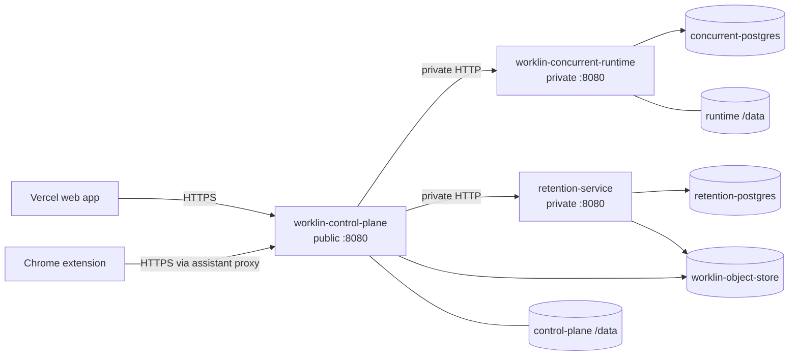

# Minimal Northflank Fresh Production Plan

Status: retained deployment proposal and historical provisioning checkpoint.
The current planning direction, requested on 2026-09-11, is
[the existing Vercel app plus a single VPS under a hard $20 additional monthly
cap](twenty-dollar-single-vps-plan.md).
The topology below is not a live inventory. Recheck provider state before
resuming provisioning; the selected plan does not purchase or delete resources.

### Provisioning checkpoint — 2026-09-07

- The Worklin project is empty; no resources were created in this session.
- GitHub is connected. Northflank loaded `runtime/Dockerfile` from `main`.
- Prepared PostgreSQL form: `worklin-postgres`, PostgreSQL 17,
  database `worklin`, one replica, private TLS, `nf-compute-20` (512 MB),
  6 GB NVMe, automatic disk expansion disabled. Displayed total: $6.31/month.
  The 256 MB tier is unsupported for PostgreSQL; 6 GB is the minimum offered
  storage. The user approved $6.31/month plus applicable taxes. Clicking
  Create addon opened the mandatory Add a payment method dialog; creation is
  blocked until the user adds a card. No addon creation was confirmed. Preserve
  this spending authorization when resuming; do not request it again.
- Prepared, unsubmitted control-plane form: `worklin-control-plane`, repository
  `Logarn/Worklin-ai`, branch `main`, build context `/`, Dockerfile
  `/runtime/Dockerfile`, one 512 MB instance ($5.40/month compute). Its six
  non-secret runtime variables select control-plane mode and private routing
  to `http://worklin-concurrent-runtime:8080`. This tier is a canary candidate,
  not verified capacity.
- The control-plane form still needs credentials, a persistent `/data` volume,
  readiness checks, and removal of automatically inferred unused ports 7830
  and 8090. Do not submit it in this incomplete state.
- The remaining application services, retention worker, database role and
  database separation, object storage, backups, and total recurring cost still
  require validation. Do not treat the database quote as a full-stack quote.
- No production routing, Auth0 configuration, or Railway state was changed.

## Objective

Create a fresh deployment of the critical Worklin backend workloads in the
existing Northflank `Worklin` project while keeping the frontend on Vercel and
avoiding the per-assistant service sprawl present in Railway.

The target is the smallest topology that preserves the current security,
persistence, browser-broker, and retention boundaries:

- three long-running application services;
- two isolated PostgreSQL add-ons;
- one private S3-compatible object-store add-on with two buckets; and
- two persistent service volumes.

This plan does not create, modify, or host a frontend service on Northflank.

No Railway application data, database rows, volume contents, object-store
objects, sessions, assistants, conversations, credentials, or runtime-stack
records will be copied into Northflank. All Northflank state starts empty.

## Evidence Reviewed

The plan is based on:

- the live Railway inventory only to identify which capabilities are still
  required, not as a migration source;
- the empty Northflank `Worklin` project in `US - Central (Council Bluffs)`;
- `runtime/Dockerfile` and `runtime/entrypoint.sh`;
- `retention-service/Dockerfile`;
- the concurrent-runtime and retention production runbooks;
- the browser-broker implementation and Chrome extension routing; and
- the Vercel proxy configuration in `vercel.json`.

The Northflank team currently has no version-control provider connected. The
project also has no services, volumes, add-ons, or activity. Northflank billing
must be enabled before production resources can run.

## Railway Capability Inventory — No Data Transfer

Railway currently demonstrates the following deployed capabilities. Northflank
will recreate only the critical capability shape and will not copy their data:

| Resource | Treatment |
| --- | --- |
| `Worklin-ai` and its volume | Recreate the public control-plane capability with a new empty `/data` volume. |
| `worklin-concurrent-runtime` | Recreate as a fresh private shared runtime. |
| `worklin-concurrent-postgres` | Create a new empty dedicated Northflank PostgreSQL add-on. |
| `retention-service` | Recreate as a fresh private service. |
| `retention-postgres` | Create a new empty dedicated Northflank PostgreSQL add-on. |
| `retention-raw-production` bucket | Create an empty bucket on the new MinIO add-on. |
| `brand-intelligence-archive` bucket | Create an empty bucket on the same MinIO add-on. |
| `worklin-rt-*` services and volumes | Do not recreate or inspect for data transfer. |
| `exciting-adaptation` and its volume | Do not recreate. |

The old `worklin-rt-*` containers represent the allocation model this fresh
environment is intended to leave behind. Creating one Northflank service per
assistant would defeat the concurrent-runtime architecture.

## Target Topology



Only `worklin-control-plane` is public. The concurrent runtime, retention
service, databases, and object store use Northflank private networking.

## Critical Application Services

### 1. `worklin-control-plane`

Purpose:

- public API and authentication boundary for the Vercel application;
- assistant catalog, lifecycle, and runtime routing;
- proxy to the concurrent runtime and retention service; and
- the public browser-extension route to the selected assistant.

Northflank configuration:

- source: `Logarn/Worklin-ai`, branch `main`;
- build type: Dockerfile;
- Dockerfile: `runtime/Dockerfile`;
- build context: repository root;
- command: use the image default entrypoint;
- `WORKLIN_RUNTIME_MODE=control-plane`;
- public HTTP port: `8080`;
- health check: `GET /readyz`;
- replicas: `1` for the first cutover;
- persistent volume: `control-plane-data` mounted at `/data`.

The volume is mandatory because the control plane currently stores canonical
state in `/data/control-plane.sqlite`. Scaling this service past one replica is
out of scope until that state is moved to a shared database.

Critical configuration groups:

- canonical Vercel origin and the new Northflank API origin;
- Auth0 configuration and session secrets;
- the shared actor-token signing key;
- the private concurrent-runtime gateway origin;
- the private retention-service origin and bridge secrets; and
- the Brand Intelligence archive bucket configuration.

### 2. `worklin-concurrent-runtime`

Purpose:

- shared multi-tenant assistant execution;
- the co-located gateway and credential execution service;
- durable conversation/run state in PostgreSQL; and
- the new conversation-scoped Chrome-extension browser broker.

Northflank configuration:

- source: the same repository and `main` branch;
- Dockerfile: `runtime/Dockerfile`;
- build context: repository root;
- command: use the image default entrypoint;
- private HTTP port: `8080` for the bundled gateway;
- health check: `GET /readyz`;
- replicas: `1` for initial deployment and browser acceptance;
- persistent volume: `concurrent-runtime-data` mounted at `/data`.

Required mode and database variables:

```text
WORKLIN_RUNTIME_MODE=concurrent_service
RUNTIME_ASSISTANT_SCOPE_MODE=tenant_context
CONCURRENT_RUNTIME_DATABASE_URL=<runtime-role URL>
CONCURRENT_RUNTIME_MIGRATION_DATABASE_URL=<temporary migrator URL>
ACTOR_TOKEN_SIGNING_KEY=<same 64-hex key as control plane>
```

Browser canary variables:

```text
CONCURRENT_BROWSER_BROKER_ENABLED=true
CONCURRENT_BROWSER_ALLOWED_ORIGINS=https://example.com
```

Keep the allowed-origin list narrow during acceptance. Add real work origins
only after the `example.com` broker test passes.

The `/data` volume preserves the bundled gateway database, device/token state,
gateway security material, and CES credential store across deployments. Do not
rely on container-ephemeral storage for these identity-bound records.

### 3. `retention-service`

Purpose:

- tenant-isolated retention data and workflows;
- Klaviyo/Shopify read-side ingestion state;
- customer decisioning and review-only campaign records; and
- encrypted raw-payload object storage.

Northflank configuration:

- source: the same repository and `main` branch;
- Dockerfile: `retention-service/Dockerfile`;
- build context: repository root;
- private HTTP port: `8080`;
- health check: `GET /readyz`;
- replicas: `1` initially;
- no service volume; durable state belongs in PostgreSQL and object storage.

Keep these safety gates disabled throughout setup:

```text
WORKLIN_RETENTION_EXTERNAL_WRITES_ENABLED=false
WORKLIN_RETENTION_SEND_ENABLED=false
```

## Critical Managed Data Resources

### `concurrent-postgres`

Create a private PostgreSQL add-on for concurrent conversations, runs, broker
connections, commands, leases, and events. Use separate migration and runtime
roles. Enable TLS and scheduled native backups before accepting traffic.

### `retention-postgres`

Create a second private PostgreSQL add-on for retention. Preserve the current
migrator/runtime role split and forced-RLS verification. The steady-state
runtime role must not own tables, bypass RLS, create schema objects, or receive
the migrator credential.

Do not consolidate the two databases during the initial deployment. The
retention production runbook requires an isolated database boundary and its
backup/restore lifecycle is materially different from concurrent chat state.
A later security-reviewed project may place separate databases on one cluster,
but that is not a safe cutover optimization.

### `worklin-object-store`

Create one private MinIO add-on and two buckets:

- `retention-raw-production`;
- `brand-intelligence-archive`.

Use distinct service users/policies so the control plane cannot read retention
raw payloads and the retention service cannot write the Brand Intelligence
archive. Enable TLS, bucket versioning where available, and scheduled storage
backups. Configure the application for MinIO path-style S3 addressing.

One MinIO add-on supplies the two required empty buckets without mixing their
namespaces or credentials.

## Resources Explicitly Not Created

- no Northflank frontend service;
- no standalone gateway service;
- no standalone assistant service;
- no standalone credential-executor service;
- no `worklin-rt-*` service per assistant;
- no Redis or Valkey service;
- no Qdrant service for the first cutover;
- no pooled worker fleet;
- no public database, object-store, concurrent-runtime, or retention endpoint;
- no second object-storage add-on; and
- no autoscaling or multi-region replicas before single-replica acceptance.

Gateway, assistant, and CES are already supervised inside
`runtime/Dockerfile`; splitting them would add cost and network/secrets
boundaries without helping this deployment. Qdrant is not required by the
concurrent browser-broker path, and the runtime image already disables local
dense embeddings unless explicitly provisioned.

## Northflank Preparation

1. Enable billing for `Codegod123's Team`.
2. Connect the team's GitHub integration to `Logarn/Worklin-ai` with the
   smallest repository scope Northflank supports.
3. Keep the existing `Worklin` project and `US - Central` region.
4. Create project secret groups rather than entering secrets as build
   arguments or committing them:
   - `worklin-shared-auth`;
   - `worklin-control-plane`;
   - `worklin-concurrent-runtime`;
   - `worklin-retention-bridge`;
   - `worklin-retention-service`;
   - `worklin-object-store`.
5. Generate new Northflank-specific database and storage credentials. Reuse
   only secrets that are protocol identity across services, such as the actor
   signing key and coordinated retention bridge secrets.

Connecting the GitHub account and enabling billing require the account owner at
implementation time. Secret values must not be copied into this plan, Git,
browser logs, screenshots, or deployment output.

## Fresh-Environment Deployment Sequence

### Phase A: Create empty data resources

1. Create both empty PostgreSQL add-ons with TLS and backup schedules.
2. Create the empty MinIO add-on and its two private buckets.
3. Create two empty persistent volumes.
4. Create fresh migration and runtime database roles. Do not reuse Railway
   database credentials.
5. Apply concurrent-runtime and retention migrations to the empty databases
   through one-time private migration jobs.
6. Apply retention runtime grants and run the forced-RLS verification suite.
7. Remove migration credentials from steady-state service configuration.

### Phase B: Deploy without public traffic

1. Deploy all three application services with fresh secret values and safety
   gates disabled where possible.
2. Configure the control plane to use the Northflank private concurrent-runtime
   and retention-service origins from its first startup.
3. Verify private DNS from the control plane to both private services and from
   each service to its assigned add-ons.
4. Verify both buckets are empty, private, and accessible only through their
   intended service credentials.
5. Create a new account and assistant through the normal application flow;
   do not seed or import a Railway assistant.

There is no Railway export, database import, object mirror, volume copy,
historical row reconciliation, or runtime-stack URL rewrite in this plan.
Migration jobs initialize schema only; they do not transfer application data.

## Vercel and Identity Cutover

The Vercel app remains where it is, but it currently contains hard-coded
Railway rewrite destinations. Before production cutover:

1. Assign the control plane a Northflank public TLS endpoint, preferably a
   stable API domain rather than a provider-specific hostname.
2. Replace the Railway destinations in `vercel.json` for `/callback`,
   `/_allauth/*`, `/v1/*`, and `/logout` with the new control-plane origin.
3. Set the Vercel production variables `VITE_PLATFORM_API_BASE_URL`,
   `VITE_AUTH_API_BASE_URL`, and `VITE_DAEMON_API_BASE_URL` consistently.
4. Update Auth0 callback, logout, CORS, and web-origin allowlists for the new
   backend origin while retaining `https://worklin-ai.vercel.app` as the web
   origin.
5. Deploy Vercel once and verify the proxy before switching users.

Using a stable custom API domain makes future provider changes independent of
the frontend build. If DNS is not ready, use the generated Northflank endpoint
for the canary and change it once more after the custom domain is verified.

## Verification Gates

### Infrastructure

- all three service deployments are healthy;
- `/healthz` and `/readyz` pass through the public control-plane endpoint;
- the concurrent runtime and retention service have no public endpoint;
- PostgreSQL and MinIO accept traffic only through private networking;
- scheduled database backups exist, and one restore drill succeeds;
- the two `/data` volumes survive a service redeploy.

### Fresh state and security

- the control-plane SQLite database starts with no Railway organizations,
  assistants, conversations, sessions, or runtime stacks;
- both PostgreSQL databases contain only freshly applied schemas and data
  created through Northflank acceptance testing;
- retention runtime identity is non-superuser and `NOBYPASSRLS`;
- every retention tenant table has RLS enabled and forced;
- both object-store buckets start empty;
- no secret appears in Git, image layers, build arguments, logs, or screenshots.

### Application

- Vercel signup/login/logout and Auth0 callback work;
- a newly created assistant resolves to the Northflank concurrent runtime;
- a saved conversation streams a normal assistant response;
- retention integrations and read-only customer views load;
- external writes and sending remain disabled.

### Browser broker

1. Confirm the selected assistant advertises `browser_broker_v1`.
2. Load the updated Chrome extension and select production.
3. Open a saved Worklin conversation and explicitly enable Browser use.
4. Confirm the extension opens the resumable broker event stream through the
   public control-plane proxy.
5. Ask the assistant to open `https://example.com`, observe it, and perform one
   harmless click/type sequence in the leased tab.
6. Verify manual takeover, assistant resume, stale-element rejection, and
   conversation/client isolation.
7. Confirm no password, payment, OTP, upload, download, cookie, browser-setting,
   localhost, or private-network action is exposed.

Browser use is not accepted merely because the service is healthy; the full
extension-to-control-plane-to-private-runtime round trip must pass.

## Cutover and Rollback

1. Point Vercel and Auth0 at the fresh Northflank control plane.
2. Run the application and browser-broker gates.
3. Treat the Northflank deployment as a new environment: users create new
   sessions, assistants, integrations, conversations, and retention state.
4. If a critical gate fails, restore the prior Vercel rewrites and Auth0 URLs.
   Northflank can then be repaired or recreated without reconciling data with
   Railway.
5. Railway retirement is outside this setup plan. Any later deletion requires
   a separate explicit approval and must not be presented as data migration.

## Implementation Order

1. Northflank billing and GitHub integration.
2. Provider-neutral deployment configuration and documentation changes in the
   repository.
3. PostgreSQL, MinIO, secrets, and volumes.
4. Three service deployments with no production traffic.
5. Fresh schema initialization and security verification.
6. Private-network and browser-broker canary using a new assistant.
7. Vercel/Auth0 cutover.
8. Backup/restore drill and acceptance soak.

## Definition of Done

The setup is complete only when Vercel serves the existing Worklin web
application, the Northflank control plane is the sole public backend, all
Northflank data stores began empty, a newly created assistant works, the Chrome
extension completes a real scoped browser action through the concurrent
runtime, and backup and rollback procedures are proven. No Northflank service
may depend on Railway data or an internal Railway hostname.

## Northflank References

- [Build with a Dockerfile](https://northflank.com/docs/v1/application/build/build-with-a-dockerfile)
- [Networking on Northflank](https://northflank.com/docs/v1/application/network/networking-on-northflank)
- [Deploy PostgreSQL on Northflank](https://northflank.com/docs/v1/application/databases-and-persistence/deploy-databases-on-northflank/deploy-postgresql-on-northflank)
- [Backup, restore, and import data](https://northflank.com/docs/v1/application/databases-and-persistence/backup-restore-and-import-data)
- [Deploy MinIO on Northflank](https://northflank.com/docs/v1/application/databases-and-persistence/deploy-minio-on-northflank)
