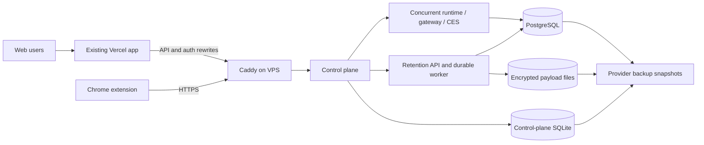

# Worklin deployment under a hard $20 additional monthly cap

Status: selected cost-constrained architecture. Repository deployment work is
complete and locally verified; managed-infrastructure release gates, provider
provisioning, and production cutover remain pending.

Prepared: 2026-09-11. Provider prices and terms were checked on that date.

## 1. Hard constraint and decision

The existing Vercel app and its current bill are a required, fixed component.
The additional recurring infrastructure bill must stay at or below **$20 USD per
month, including expected tax and the backup allowance**. The plan must not add
another Vercel project or paid Vercel product that increases that fixed bill.

Usage-priced model APIs, the domain registration, email delivery, and payment
processing are product operating expenses rather than the additional hosting in
this plan; they need separate hard limits. If the same $20 must also pay for
model tokens, the current hosted product cannot be operated reliably within the
cap.

Use **one x86-64 VPS** for the commercial pilot. It hosts:

- the public control plane/API behind a TLS proxy;
- the private concurrent assistant runtime, gateway, and credential service;
- PostgreSQL for runtime and retention state;
- the durable background processors; and
- persistent encrypted application data.

The existing Vercel deployment continues to build and serve `apps/web`. Its
backend rewrites point to the public control-plane endpoint on this VPS.

The preferred starting size is **4 shared vCPU, 8 GB RAM, and 80 GB NVMe**.
Hetzner CX33 in Nuremberg is the budget baseline. Contabo Cloud VPS 10 is the
fallback if Hetzner cannot provision the account or region and the final checkout
total stays within the purchasing guard below.

This is a single-machine pilot architecture. It has durable state and backups,
but it does not have high availability: a host failure or provider outage takes
the whole product offline until recovery. That is the explicit reliability
tradeoff that makes the $20 ceiling possible.

## 2. Vercel role and budget boundary

Vercel remains the canonical production frontend. It builds and serves the Vite
application, terminates the web origin, and forwards the existing authentication
and API paths to the VPS. Its current subscription is outside the incremental
$20 ceiling and must not increase as part of this architecture.

Do not move the stateful backend into new Vercel products under this budget.
Serverless functions would still need durable PostgreSQL, file storage, and a
place for long-running jobs. Keeping those components together on one VPS uses
the current code shape and keeps their total additional cost measurable.

The prior [Vercel backend plan](vercel-backend-and-single-worker-plan.md) remains
useful design analysis, but its modeled $60 to $85 total allowance is outside
the approved incremental ceiling. Do not purchase its managed database, Blob
storage, or separate worker resources under this budget.

## 3. Monthly budget

The baseline uses current Hetzner Germany/Finland list prices in USD, excluding
VAT. The final tax depends on the billing address.

| Item | Calculation | Budgeted monthly cost |
| --- | --- | ---: |
| Hetzner CX33 | 4 vCPU, 8 GB RAM, 80 GB NVMe | $9.99 |
| Primary IPv4 | One address | $0.60 |
| Hetzner automatic backups | 20% of server price, 7 slots | $2.00 |
| Tax/exchange reserve | 20% of the above, rounded up | $2.60 |
| **Expected additional total** |  | **$15.19** |
| **Unallocated monthly buffer** | $20.00 - $15.19 | **$4.81** |

The provider invoice must be reviewed before checkout. Do not order if the
displayed recurring total after tax exceeds **$17**. The remaining $3 is kept
for exchange-rate changes and small provider adjustments; it is not available
for a second always-on service.

Hetzner's published price is [$9.99 per month for CX33 after the 15 June 2026
price adjustment](https://docs.hetzner.com/general/infrastructure-and-availability/price-adjustment/),
excluding IPv4 and VAT. Its current CX33 specification is
[4 vCPU, 8 GB RAM, and 80 GB NVMe](https://www.hetzner.com/cloud/cost-optimized/).
A [primary IPv4 is $0.60 per month](https://docs.hetzner.com/cloud/servers/primary-ips/overview/),
and [automatic backups cost 20% of the server price and provide seven slots](https://docs.hetzner.com/cloud/billing/faq/).

The fallback Contabo offer was listed at
[EUR 4.50 per month for 3 vCPU, 8 GB RAM, and 75 GB NVMe](https://contabo.com/en/pricing/)
when checked. Location, term, tax, and optional backup choices can change the
checkout price. Choose it only if the recurring checkout total is at most
$12 before the separate $3 safety buffer, there is no setup fee, and automated
backups still fit below the $17 purchasing guard.

## 4. Minimal topology

There is one additional server and one additional public IP. The boxes inside
the VPS are process or container boundaries; they do not create separate hosting
bills. Only Caddy publishes ports 80 and 443. PostgreSQL, the concurrent runtime,
retention, and credentials remain on the private Docker network.

Keep the Vercel web origin canonical. Update its existing rewrites for
`/callback`, `/_allauth/*`, `/v1/*`, and `/logout` to the stable VPS API origin.
Preserve WebSocket and event-stream headers through both proxy layers. Give the
Chrome extension the same stable API origin when it needs a direct streaming
connection. No private service receives a public port or DNS record.

## 5. What runs on the VPS

| Component | Deployment form | Persistent state | Starting memory ceiling |
| --- | --- | --- | ---: |
| Caddy API proxy | 1 container | TLS state only | 128 MB |
| Control plane | 1 container | SQLite volume | 512 MB |
| Concurrent runtime, gateway, CES | 1 existing runtime container | runtime and security volumes | 2 GB |
| Retention API and worker | 1 container | PostgreSQL and encrypted files | 512 MB |
| PostgreSQL 17 | 1 container | one database volume | 1 GB |
| Migrations | one-shot containers during deploy | none | up to 512 MB temporarily |

The steady container ceilings total about 4.2 GB. Reserve roughly 2 GB for the
Linux kernel, Docker, filesystem cache, monitoring, and short-lived deployment
work. Keep at least 1.5 GB free during normal operation. Build production images
in CI or on a development machine and pull/load immutable images on the VPS;
do not compile the runtime image on an 8 GB production host during live traffic.

The [`deploy/vps/compose.yml`](../../deploy/vps/compose.yml) profile co-locates
the control plane, concurrent runtime, retention worker, PostgreSQL, and Caddy
with the resource limits and storage layout described here.

## 6. Data and durable jobs

Keep the current control-plane SQLite database for the pilot. Moving it to
managed PostgreSQL would add cost and engineering without improving availability
while every component is on one machine. Store it on a named volume and back it
up through SQLite's backup API or with writers stopped.

Run one PostgreSQL process with two logical databases:

- `worklin` for concurrent runtime runs, events, leases, and browser state; and
- `worklin_retention` for retention records and durable retention jobs.

Use separate runtime and migrator roles for each database. Runtime roles must
not own tables or receive migration privileges. Keep forced row-level security
and tenant-isolation tests as release gates.

### Supabase cost decision

This profile does not add a separately billed database service. PostgreSQL runs
inside the VPS that is already included in the budget, so its incremental
provider charge is **$0**. Supabase therefore cannot remove a database invoice
from this design.

Supabase Free is not the selected production database. Its current limits are
[500 MB of database data, no automatic backups, and pausing after a week of low
activity](https://supabase.com/pricing). Exceeding 500 MB can place the database
in read-only mode, as described in Supabase's
[database-size documentation](https://supabase.com/docs/guides/platform/database-size).
The Pro plan starts at $25 per month, which exceeds the entire additional
hosting allowance before the VPS is paid for.

Moving to Supabase would replace only the PostgreSQL used by the concurrent
runtime and retention service. The control plane would still use its local
SQLite volume, encrypted payload files would still live on the VPS, and the VPS
would still be required for long-running work. It would also require new role
bootstrap, external backup, connection-pool, migration, and recovery testing.
For an IPv4 VPS, Supabase recommends its shared session pooler for persistent
backends; transaction pooling does not support prepared statements. See the
[official connection guidance](https://supabase.com/docs/guides/database/connecting-to-postgres).
Revisit this decision only if an existing paid Supabase project becomes a fixed
cost outside the $20 cap or the pilot can accept the Free plan's data and
recovery limits.

Long-running work does not need another server. The concurrent runtime and
retention worker claim durable PostgreSQL jobs with leases, renew leases while
working, persist progress, and resume or retry after a process restart. HTTP
handlers enqueue work and return; request lifetimes never own durable work.

Use one global active assistant turn for the first pilot and one retention job
at a time. Raise concurrency only after the VPS remains below all of these for
seven representative days:

- memory below 70% at p95 and below 85% at peak;
- no sustained swap activity;
- database CPU below 60% at p95;
- queue wait below 30 seconds for interactive work; and
- at least 20 GB disk free.

## 7. File storage under the cap

The retention service supports S3-compatible storage for existing deployments.
A separate paid bucket violates the minimal-service goal, while running MinIO
adds another memory-heavy service and introduces a license choice that has not
been approved for this repository.

Implement a filesystem-backed `RawPayloadStore` using the existing interface.
The adapter stores the already encrypted payload bytes beneath a dedicated
`/data/retention-objects` volume. It must:

- reject absolute paths and path traversal;
- derive deterministic paths from validated tenant/object identifiers;
- write to a temporary file, `fsync`, then atomically rename;
- use restrictive directory and file permissions;
- support readiness, put, and delete with the same behavior as the S3 adapter;
  and
- never log object bytes, encryption keys, or full credentials.

Retain the S3 adapter for future deployments. Select the filesystem adapter
through explicit configuration so existing installations remain compatible.
The encryption key stays outside the repository in the credential environment
and must be backed up separately; encrypted files cannot be recovered without it.

This local file design shares the VPS failure domain. Provider backups protect
against many operator and disk-loss cases, but they are not an independent,
cross-provider backup. An external encrypted backup target becomes the first
paid addition when the hosting ceiling is raised.

## 8. Pilot feature scope

Enable the capabilities that the current shared runtime is designed to support:

- account authentication and the web application;
- text chat through the concurrent runtime;
- durable conversation/run events and reconnect behavior;
- scoped browser-extension actions and takeover/resume; and
- retention ingestion and processing after the filesystem store is implemented
  and its release gates pass.

Keep concurrency at one active assistant turn and one retention job. Keep brand
archiving, outbound campaigns, external writes, and campaign sends disabled
until their existing gates pass. Dedicated-assistant features such as host shell,
workspace tools, voice, arbitrary channels, and per-user always-on runtimes are
outside this single shared-runtime pilot.

Model inference remains an external usage-priced API. Set provider-side monthly
budgets and request limits independently. A traffic spike in model calls must not
be able to turn a $20 hosting promise into an uncapped total operating bill.

## 9. Security and operations

- Use Ubuntu LTS x86-64, automatic security updates, Docker Engine, and Compose.
- Allow inbound 80/443 publicly. Restrict SSH by key and source IP where possible.
- Disable password login and root SSH after the operator account is verified.
- Keep secrets under `/etc/worklin-vps`, owned by root and mode `0600`.
- Pin production images to immutable digests or release-specific image digests.
- Set Docker log rotation and disk alerts; logs must not consume the data disk.
- Keep PostgreSQL and internal services without host port mappings.
- Enable the provider firewall as well as the host firewall.
- Turn on the seven-slot provider backup option at server creation.
- Run a monthly restore drill into a temporary server, then delete that temporary
  server the same day. Hetzner bills servers hourly up to the monthly cap; record
  the small drill charge against the $4.81 buffer.

Monitor at least host memory, swap, disk usage, load, container restarts,
PostgreSQL health, job queue age, and public readiness. A simple host timer can
send alerts through an already-approved channel; do not buy a monitoring server.

## 10. Implementation status

| Work item | Status |
| --- | --- |
| Keep the existing Vercel build and change Railway rewrites only after VPS acceptance | Deployment gate; pending a real hostname |
| Caddy API/auth proxy with SSE flushing and WebSocket support | Implemented in the VPS profile |
| Filesystem `RawPayloadStore`, explicit configuration, traversal protection, atomic writes, readiness, and tests | Implemented and scoped tests pass |
| Dedicated encrypted-payload volume with S3 compatibility retained | Implemented in the VPS profile |
| PostgreSQL 1 GB ceiling and one active assistant turn | Implemented in the VPS profile |
| Reject hosts below 7 GB memory or 60 GB disk | Implemented by `deploy/vps/preflight.sh` |
| Coordinated encrypted PostgreSQL and volume backups plus verification | Implemented by the VPS backup scripts; real restore drill pending |
| Reproducible off-host image build, bundle, IDs, and checksum | Implemented by `deploy/vps/build-images.sh`; release build pending |
| Verify Vercel cookies, callbacks, logout, streaming, and extension access | Deployment acceptance gate |
| VPS runbook, restore steps, and measured invoice | Runbook implemented; first invoice pending |

Repository completion does not purchase infrastructure. The production-only
items require a provisioned VPS, real DNS, secrets, and an isolated restore
target. Do not change Vercel's live Railway rewrites before the VPS endpoint
passes acceptance.

## 11. Deployment sequence

1. Review the locally verified repository changes and run the same release gates
   in CI.
2. Confirm the Vercel app stays on its current plan, the domain is already owned,
   and model/API budgets are separate.
3. At provider checkout, select one CX33 in Nuremberg, one IPv4, Ubuntu LTS, and
   automatic backups. Stop if recurring cost after tax exceeds $17.
4. Create the server with an SSH key and provider firewall; add no volumes,
   load balancers, managed databases, or object storage.
5. Install Docker and Compose, load the immutable images, and create secret files
   outside the checkout.
6. Start PostgreSQL and migrations, then internal services, then Caddy.
7. Test two tenants for data isolation, auth callbacks, chat streaming, cancel,
   reconnect, browser takeover/resume, job restart, and retention deletion.
8. Reboot the VPS and verify all durable state and credentials return correctly.
9. Create and restore a backup before routing real users.
10. Point the API DNS record at the VPS, update the Vercel rewrites and Auth0
    allowlists, and keep the existing Vercel web origin.
11. Set alerts at 70% memory, 75% disk, repeated restarts, and queue age over
    30 seconds. Review the first invoice against the $20 cap.

## 12. Purchasing guard and scale trigger

Purchase exactly these infrastructure resources for the pilot:

- one 8 GB x86-64 VPS;
- one primary IPv4; and
- the provider's automatic backup option.

Do not purchase Northflank add-ons, additional Vercel products, a managed
PostgreSQL cluster, Redis, a load balancer, a second worker server, or a separate
object store. The previously approved Northflank database was never created, so
there is nothing to cancel from that attempted setup.

Raise the budget or redesign before any of these occur:

- more than one active assistant turn is routinely needed;
- p95 memory exceeds 70% for seven days;
- disk growth projects less than 90 days of free capacity;
- a formal recovery-time or availability commitment is required;
- customer retention data requires independent cross-provider backups; or
- maintenance downtime becomes unacceptable.

At that point, the first separation should be a managed or second-host database,
followed by the worker. The existing Vercel frontend remains in place throughout.
