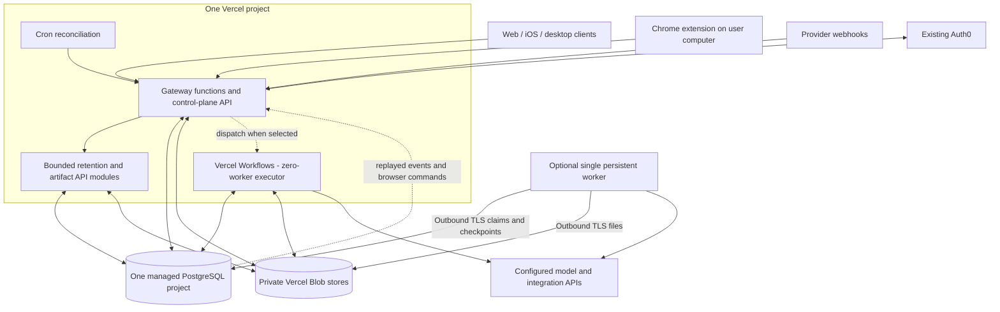

# Vercel backend with zero or one persistent worker

Status: superseded for the approved $20 additional monthly backend-hosting
ceiling; retained as design analysis. The selected architecture keeps the
existing Vercel frontend and uses the
[single-VPS plan](twenty-dollar-single-vps-plan.md) for the backend. No
deployment changes.
Prepared: 2026-09-11. Provider documentation and prices checked on that date.

The existing Vercel app and bill are fixed outside the additional cap. Do not
purchase the managed database, Blob storage, or separate worker modeled below
under the current budget.

## 1. Decision and scope

Make Vercel the only public application backend and frontend host. Use one
managed PostgreSQL project for durable application state, and private Vercel
Blob storage for files. Keep at most one continuously running worker deployment
for work that cannot yet execute as bounded, resumable Vercel steps.

Recommended implementation strategy: build the Vercel backend and durable job
contract first; run the bounded-step proof of concept before purchasing a worker.
Use **zero additional application servers** if that proof covers the launch
workloads. Otherwise deploy **one worker**, using the same job contract, and
move eligible job types to Vercel Workflows incrementally. Never require both
engines to execute the same job.

One worker is the more conservative migration target for the current code.
Zero is a credible target for chat, extension browser actions, API integrations,
scheduled checks, and paginated retention processing. Neither is a configuration
switch on the current Docker image: both require the refactors in this plan.

This plan retains retention and brand intelligence as logical modules. It does
not assume that removing those product features is acceptable. Their existing
implementation gaps remain gaps; hosting them does not implement missing tools,
connectors, or outbound campaign delivery.

“Zero servers” means zero machines or continuously running application services
that we operate. It does not mean zero databases, zero managed services, or zero
hosting bill. A literal restriction to Vercel-owned products alone cannot be
claimed with this design: PostgreSQL is supplied by a Marketplace provider.

The minimum includes these distinct things:

| Item | Zero-worker variant | One-worker variant | Who operates infrastructure? |
| --- | --- | --- | --- |
| Vercel project: frontend and API functions | 1 | 1 | Vercel |
| PostgreSQL project/cluster | 1 | 1 | Managed provider, proposed Neon |
| Private file storage | Vercel Blob | Vercel Blob | Vercel |
| Durable execution | Vercel Workflows | Existing PostgreSQL job state plus worker | Vercel / our worker deployment |
| Persistent worker deployment | 0 | 1 replica | Northflank proposed; no public application port |
| Existing identity provider | Keep Auth0 | Keep Auth0 | Auth0 |
| Model API | Existing configured provider | Existing configured provider | Model provider |

Two private Blob stores are proposed when retention and general artifacts are
both enabled: one for encrypted retention payloads, one for artifacts/archives.
They are storage resources, not two servers. Separate store credentials provide
a clearer boundary than assuming an object path prefix is an access policy.
Start with only the store needed by enabled features.

## 2. What the repository actually does today

These findings come from the current checkout, not an assumption about Vercel:

| Evidence | Current behavior | Required change |
| --- | --- | --- |
| [vercel.json](../../vercel.json) | Builds a Vite SPA; auth and API rewrites point to Railway | Route the existing paths to Vercel functions after acceptance |
| [control-plane entrypoint](../../control-plane/src/index.ts) | Opens `bun:sqlite`, creates schema, starts Express and background schedulers | Separate request handler construction, storage, migrations, and workers |
| [assistant store](../../control-plane/src/assistant-store.ts), [membership store](../../control-plane/src/organization-membership-store.ts) | Synchronous SQLite queries and schema initialization in repository calls | Async PostgreSQL repositories; deployment-time migrations |
| [public edge](../../control-plane/src/public-edge.ts) | Persistent HTTP listener forwarding to control plane | Serverless gateway adapter with preserved auth and routing |
| [concurrent runtime](../../docs/concurrent-runtime-service.md) | Shared tenant-scoped PostgreSQL, persisted runs/events, browser waits and leases | Reuse state model; detach execution from HTTP process lifetime |
| [runtime entrypoint](../../assistant/src/concurrent-runtime/main.ts) | Initializes process-level service and starts `Bun.serve` | Export bounded executor and request adapters without listener side effects |
| [store interface](../../assistant/src/concurrent-runtime/store.ts) | Claims/renews/completes a run with tenant context | Add durable discovery/reconciliation; do not depend on another user retry |
| [retention entrypoint](../../retention-service/src/index.ts) | Creates HTTP handler and starts its worker in one process | Export API factory and bounded job processor separately |
| [retention worker](../../retention-service/src/worker.ts) | In-memory tenant wake set drives durable job claims | Durable wake/discovery and scheduled reconciliation |
| [raw-payload store](../../retention-service/src/raw-payload-store.ts) | `RawPayloadStore` interface with Bun S3 implementation | Implement private Blob adapter; retain S3 for old deployments |
| [container startup](../../runtime/entrypoint.sh) | Filesystem paths, Unix users, CES/gateway lifecycle and multiple processes | Do not upload this entrypoint as a Vercel function |

The control plane also contains archive, research-refresh, worker-health,
capacity and retention wake timers. Each must either become a bounded job,
move into the one worker, or be explicitly disabled for this placement. Merely
exporting its Express app while leaving the timers active is insufficient.

Existing [retention production gates](../../docs/retention-service-production-runbook.md)
allow a dedicated database **or equivalent database/schema isolation**. Two
separate paid PostgreSQL clusters are therefore not intrinsically required.
We still need separate identities and privileges, and must prove isolation.

The sibling `vellum-assistant-platform` checkout was not present during this
review. Platform compatibility is an implementation gate, not a completed check.
Existing unrelated working-tree changes were not included in a deployment.

## 3. Current Vercel capabilities that affect the design

Use generally available behavior as the baseline, and verify project-specific
availability in the proof of concept:

| Capability | Verified constraint | Design consequence |
| --- | --- | --- |
| Fluid functions | Pro default 300 seconds; 800 seconds generally available; 1,800 seconds is extended beta | Target at most 240 seconds of useful step work with checkpoint headroom |
| Function bundles and bodies | Standard bundle 250 MB; ordinary request/response body limit 4.5 MB | Exclude desktop/browser binaries; direct file upload rather than API buffering |
| Streaming | Request lifetime includes streaming | Streams reconnect; stream closure cannot cancel or lose a job |
| Bun runtime | Beta; provider manages patches, currently documents `1.4.x`/`1.x` selectors | Prefer Node-compatible functions; do not claim the repo's exact Bun version is supported |
| WebSockets | Beta; connections close at function duration and reconnects may hit another instance | Existing SSE plus replay is the baseline; no new realtime service required |
| Workflows | Durable execution and waits backed by managed persistence and Queues | Long wall-clock workflows can use zero workers if every active step is bounded |
| Storage | PostgreSQL through Marketplace; Blob supports private objects | Database and files stay external to ephemeral function instances |

Sources: [function limits](https://vercel.com/docs/functions/limitations),
[Bun runtime](https://vercel.com/docs/functions/runtimes/bun),
[WebSockets](https://vercel.com/docs/functions/websockets),
[Workflows](https://vercel.com/docs/workflows),
[storage](https://vercel.com/docs/storage),
[private Blob](https://vercel.com/docs/vercel-blob/private-storage).

An eight-hour workflow waiting for provider callbacks is a good serverless
candidate. An eight-hour uninterrupted subprocess is not made durable by
wrapping it in a workflow. A worker survives a function timeout, but its own
process can still crash; checkpoints are necessary in either architecture.

## 4. Target topology



The diagram shows the two executor options for comparison. Choose one executor
per job type and placement generation. Workflows is not required in the initial
one-worker profile. A mixed migration may use both temporarily, with explicit
ownership and no duplicate execution.

No inbound user or webhook traffic goes to the worker. It needs outbound TLS
to PostgreSQL, Blob and approved provider APIs. A loopback/private health probe
can be used by its hosting platform; there is no publicly advertised worker URL.

All public assistant ingress still passes through gateway-owned policy. Vercel
is the deployment target for that gateway adapter, not permission to create
direct public assistant endpoints.

## 5. Minimum deployable services

### A. One Vercel project

Keep the Vite/React Router frontend. Do not introduce Next.js solely to obtain
functions. Add serverless entrypoints alongside the existing static build.
The exact adapter and Workflow build integration are validated in Phase 1.

Public functions cover:

- Login, callback, logout, session validation and organization membership.
- Assistant catalog, settings, conversation/message reads and acceptance.
- Event replay, browser grants, broker connections and browser result ingress.
- Retention read APIs, verified webhook acceptance and job creation.
- Artifact metadata and authenticated upload/download authorization.
- Operational health and bounded cron reconciliation.

Retain `/callback`, `/_allauth/*`, `/v1/*`, `/logout`, and existing app deep links.
The root `api/` directory can contain deployment glue; route implementation and
security policy belong to `gateway/` and the corresponding domain modules.
Keep the SPA fallback after API routing so it cannot swallow API errors.

Split functions by meaningful trust/dependency boundary (auth/control,
conversation/broker, retention, artifacts, maintenance), not one function per
database table. No deployment-time schema writes and no timer creation on import.

### B. One managed PostgreSQL project

Proposed provider: Neon via Vercel Marketplace, subject to the connection and
restore tests. One primary compute endpoint; no replica at launch. Separate
databases `worklin` and `worklin_retention` within the project. Control-plane,
conversation and dispatch schemas live in `worklin`; retention owns its database.

Database names and credentials are configuration, not a provider assumption.
Verify multiple database support, connection pooling, RLS and restore controls
on the selected plan before purchase. If using another managed PostgreSQL
provider, the same contract applies.

Keep application state off the worker disk. Do not run PostgreSQL on the worker:
that would put web availability and durable jobs behind one machine and complicate
Vercel connectivity, patching and backups.

### C. Vercel Blob rather than a MinIO server

Use private storage for raw encrypted retention payloads and private artifacts.
Keep object metadata, tenancy, encryption key version, size and content hash in
PostgreSQL. Public frontend assets can remain in the static deployment.

Implement the existing `RawPayloadStore` interface using Blob's SDK; Blob is not
an S3 endpoint that can be substituted in the current environment variables.
Generalize object references with a versioned provider/store/key descriptor.
Retain the old S3 reader for persisted legacy references until migration completes.

### D. Zero or one worker

The optional worker is a new slim application entrypoint, not
`runtime/entrypoint.sh`. Initially it reuses the configured concurrent executor
and retention processors. It performs only trusted server-owned job types.

Start with one 2 GB instance and at most one expensive job at a time. Run short
bookkeeping independently so lease heartbeats cannot be starved. Measure before
raising concurrency or reducing RAM. One 1 GB instance is a possible optimization,
not a verified minimum. There is no server-side Chromium in this sizing.

No persistent worker volume is needed after all canonical state and files have
been externalized. Scratch files use per-job temporary directories, bounded
disk quotas and cleanup on completion/startup. An interruptible scratch file
must be reproducible from durable inputs.

### E. Existing external accounts

Retain Auth0, the configured LLM provider and existing error reporting. These
are real dependencies even though they are not extra Worklin servers. Do not
add a second auth vendor, AI gateway, Redis, vector database, standalone queue,
container orchestrator, reverse proxy server or separate retention host.

## 6. Workload placement and feature coverage

| Workload | Vercel request | Durable execution | Extra server needed? |
| --- | --- | --- | --- |
| Login / membership / settings | Validate and perform bounded DB transaction | None | No |
| Chat turn | Accept and persist, return run identifier | Worker initially or bounded Workflow model/tool steps | Not inherently |
| Browser on connected user Chrome | Grant, command replay, result ingress | Persist and park run awaiting extension | No browser server |
| Human decision / hours-long provider wait | Validate response, persist event | Workflow hook or parked PostgreSQL job | No active worker while waiting |
| Shopify/Klaviyo pagination | Verify ingress, create job | One page per checkpoint, bounded retry | Usually no after refactor |
| Retention normalization | Read APIs and acceptance only | Bounded page/batch job | Usually no after refactor |
| Brand research / archive | Accept request, display progress | Checkpoint fetch/model/extract/store stages | Worker until dependencies are audited |
| Report/file conversion | Authorize upload and output access | Bounded conversion if package fits; worker otherwise | Sometimes |
| Scheduled user work | Persist schedule | Cron claims due schedule and creates idempotent job | No dedicated scheduler server |
| Always-connected channel client / media bridge | Webhook variant where available | Persistent adapter if continuous connection is essential | One worker may be needed; audit protocol |
| Headless server browser / uninterrupted native process | Accept job | Worker or managed sandbox | Yes unless using another managed execution service |
| Arbitrary tenant shell / desktop control | Not part of trusted job API | Dedicated isolation design needed | Not safely promised by this shared worker |

The current concurrent tier does not provide full dedicated assistant feature
parity: workspace tools, general memory, personal provider credentials, voice,
channels, skills and arbitrary shell are not automatically available. The
implementation must keep capability responses accurate. Existing dedicated
instances retain their current routes until their capabilities and data have a
tested replacement; never silently move those users into a reduced tier.

Retain retention external-write and campaign-send gates. This plan does not
enable delivery functionality absent from the current repository.

## 7. Durable state, database privileges and tenancy

### State ownership

| Data | Authoritative store | Ownership |
| --- | --- | --- |
| Users, membership, assistants, sessions, settings | `worklin.control` schema | Control-plane repositories |
| Messages, runs, steps, conversation events | Existing concurrent tables in `worklin` | Assistant execution repositories |
| Broker grants, generations, tab leases, receipts | Existing browser tables in `worklin` | Gateway/broker repositories |
| Runnable-job references, schedule claims, delivery outbox | `worklin.jobs` schema | Dispatcher; minimal identifiers only |
| Customer evidence, integration secrets, retention jobs/audit | `worklin_retention` | Retention repositories |
| File bytes | Private Blob | Domain-specific storage adapter |
| File ownership, hashes, retention/deletion state | Owning database | Domain repository |
| Executable code and job definitions | Versioned deployment image | Source control |

Do not replace existing run and retention-job tables with a parallel universal
queue on day one. Reuse their state machines. A small dispatch index points to
the canonical job ID, tenant and domain; it is a wake mechanism, not a second
copy of business state. Add only missing discovery/checkpoint contracts.

### Role separation

- Separate migration roles from control, conversation and retention runtime roles.
- Runtime roles cannot own protected tables, bypass RLS or create schema objects.
- Use transaction-local tenant settings plus explicit tenant predicates. A
  connection returned to a pool must carry no tenant session state.
- Retention has separate credentials and database access; revoke unintended
  `CONNECT`, public schema creation and cross-domain grants.
- Dispatcher can discover only minimal due-job metadata across tenants through
  an audited claim interface. It does not gain unrestricted transcript/customer
  reads merely to enumerate pending work.
- Domain executors perform work under an explicit immutable tenant context.
  Any narrow SQL function requiring elevated dispatch access must pin its
  search path, restrict execute grants, expose only validated fields and have
  adversarial tests. No general-purpose cross-tenant SQL RPC.
- Provider keys, signing keys and encrypted integration tokens are not job payloads.

A trusted process with multiple domain credentials still has the union of those
privileges. Co-location reduces physical isolation; database roles are not a
process sandbox. Before consolidating sensitive customer processing, review that
trade-off. Separate function entrypoints/worker subprocess environments reduce
accidental access but are not claimed to isolate a compromised root host.

### Connection management

Use TLS with certificate validation. Use the provider's pooled endpoint for
functions, a small bounded pool for the worker, and the direct endpoint for
migrations requiring a dedicated connection. Validate the adapter against the
existing multi-statement transactions; do not replace them with unrelated HTTP
queries that lose transaction-local RLS context.

No transaction or DB lock spans an LLM call, browser wait, sleep or file upload.
Start with a measured connection budget, e.g. 2 connections per warm function
instance and 4 per worker, then cap concurrency against actual pool capacity.
Those numbers are tuning candidates, not a guarantee for unconstrained scaling.

## 8. Durable job protocol for the one-worker profile

### Acceptance

1. Gateway verifies user/session or webhook signature and canonical tenant scope.
2. Validate job type, payload limits, capability and user/integration permissions.
3. In one domain transaction, persist the command, immutable input reference,
   idempotency key, job/run state, and a domain outbox record.
4. Commit before returning `202` with job/run ID and progress URL.
5. Same key plus same input returns the same result; same key plus different
   input is a conflict. A timeout after commit is safe to retry.

For retention's separate database, enqueue its job and outbox there. A relay
may copy a minimal dispatch reference to `worklin.jobs` idempotently; periodic
reconciliation repairs missed notifications. Never attempt a pretend atomic
transaction across both databases. The durable domain job is the source of truth.

### Claim and execution

1. Worker checks due runnable jobs by priority, tenant fairness and domain.
2. Claim uses an atomic compare-and-set or `FOR UPDATE SKIP LOCKED`, a lease,
   monotonically increasing fencing token, executor kind and placement generation.
3. Commit the claim; only then load scoped inputs and perform work.
4. Heartbeat extends the lease only if owner/token/generation still match.
5. Persist each recoverable boundary: provider cursor, completed step, output
   object reference, tool call identifier or external request receipt.
6. Before another external side effect, verify lease and cancellation state.
7. Completion atomically updates canonical job state and appends its durable event.

Initial tuning candidates: 90-second leases, heartbeat every 20 seconds,
30-second expired-lease sweep, one expensive job per tenant and globally one
expensive job on the first 2 GB worker. CPU-heavy operations run in a controlled
subprocess so the heartbeat loop stays responsive. Test these values under load.

When waiting for browser/human/provider input, save a `waiting_*` state, release
compute ownership and resume only after a durable result or deadline. Sleeping
jobs are not polled as runnable jobs. Record a deadline for abandoned waits.

### Recovery, delivery and side effects

Delivery is at least once. There is no claim of exactly-once external execution.
Idempotency keys and fencing can prevent duplicate local commits, but cannot
undo a provider request sent by a worker immediately before it died.

Use provider idempotency where available. Otherwise keep a side-effect intent
journal and reconcile provider state before retrying. A non-idempotent browser
click or send with an uncertain result becomes `unknown_outcome` and needs
reconciliation; do not replay it automatically. Reuse the extension's existing
receipt/action-journal behavior.

Retries use bounded exponential backoff with jitter and respect provider
`Retry-After`. Distinguish transient failure, permanent validation failure,
permission revocation, cancellation and unknown external outcome. Exhausted
attempts become a visible failed/dead-letter state in PostgreSQL, not a new queue
service. A manual retry creates an audited attempt.

Cancellation sets durable intent, aborts active cooperative calls, blocks further
side effects and prevents stale completion. Already-completed external work may
need compensation or a visible partial-result report. Kill/restart is not cancellation.

### Scheduling

One bounded Vercel Cron dispatcher claims due schedules using uniqueness on
`(schedule_id, scheduled_occurrence)` and persists jobs. Use UTC instants with the
user's timezone retained for display and recurrence calculation. Missed runs use
an explicit catch-up policy; retries cannot create duplicate occurrences.

Cron is a recovery/schedule trigger, not the lifetime of a job. Authenticate it
and tolerate duplicate/late invocations. Do not create a Vercel cron definition
per user. The one-worker profile can reconcile on a timer without invoking LLMs
unless a user-created schedule or queued request authorizes the work.

## 9. Zero-worker execution with Vercel Workflows

Keep the same public APIs, canonical jobs, events and idempotency records.
Replace the polling executor with Workflow orchestration for eligible job types.
Do not add a separately managed Redis, BullMQ or Temporal service. Workflow uses
Vercel's managed queue internally; we do not need an additional raw Queue layer.

Each workflow receives job ID, tenant scope reference and definition version,
not raw credentials or entire customer datasets. A step validates context and
claims the canonical step before effects. Database reads, network I/O, random
values and side effects belong in steps; orchestration must replay deterministically.

Example decomposition for research:

1. Load authorized inputs and persisted request configuration.
2. Fetch one bounded source batch and checkpoint its cursor.
3. Run one configured model call with a defined token/time budget.
4. Persist result/usage and create any browser command.
5. Wait durably for the result, or sleep until a retry deadline.
6. Resume the next step and finalize output references.

Start dispatch through the domain transactional outbox. Starting a workflow and
committing the application's row cannot be one distributed transaction. A
reconciler retries starts; a duplicate workflow must acquire the same job's
execution fence and become a no-op if another owns it. An engine ID is diagnostic,
not the only business identity.

For hooks, persist an incoming result before attempting to resume the workflow.
Handle a result that arrives before hook registration by reading stored state
after registration; resume calls are idempotent and retried. Treat hook tokens
as secrets and never expose them as user/browser capabilities.

Do not use workflow engine logs as permanent conversation history. Persist
product state in PostgreSQL and large bodies in Blob; engine retention is a
separate setting. Batch text progress so a token stream does not create an
unbounded number of workflow events. Split long histories into versioned child
workflows before platform event/replay limits become a problem.

Keep workflow versions addressable until their active runs complete. A deployment
must not replay an old job under an incompatible step sequence. Test version
skew and define drain/migrate policies rather than relying only on rollback.

### Zero-worker acceptance gate

Choose zero only if all launch job types meet these tests:

- Active steps complete within the chosen 240-second application deadline,
  with checkpoint/cleanup headroom inside a 300-second function configuration.
- All required dependencies fit a standard Node function bundle and execute
  without persistent local filesystem, local socket, global tenant state or
  privileged OS assumptions.
- A 24-hour waiting workflow resumes correctly after a redeploy.
- Duplicate starts, crash after commit, failed callback delivery and cancellation
  do not create duplicate accepted messages or unsafe repeated effects.
- Browser waiting/result races and client reconnects pass the existing isolation
  and unknown-outcome tests.
- Representative workloads pass the cost/latency measurements in section 17.

If only one job type fails, keep one worker for that job type. Other types can
stay on Vercel. If everything passes, do not buy a worker to reserve hypothetical
future capacity.

## 10. Chat, browser commands and realtime

Chat remains `POST message -> durable run -> progress stream -> saved result`.
The client does not hold the job open. Use the existing saved-event SSE contract,
with `Last-Event-ID`/sequence cursor and bounded reconnect windows. Proposed SSE
window: 60-120 seconds, with a clean reconnect before function timeout. Poll only
while a screen is active or a command is outstanding; do not maintain one
perpetual serverless stream for every logged-in user.

Events contain job/run/conversation identity and monotonic per-contract sequence.
Duplicates are ignored by the client. After a cursor is older than retained
transient events, return a resync response and refetch canonical state. Persisted
resource updates retain `sync_changed` invalidation semantics; live token deltas
remain domain-specific. Bound buffers and disconnect slow consumers.

Chrome remains on the user's machine. The extension obtains a conversation-scoped
grant, receives commands through gateway replay, executes permitted semantic
operations, and posts receipts/results back to Vercel. Reconnection does not
automatically create a new tab or grant. Preserve generation rotation, tab leases,
stale element rejection, takeover and actor/client/conversation isolation.

The server stores browser results before marking the run runnable. A response
lost after this commit is safe for the extension to retry. Disconnection parks
the job with a deadline and displays waiting status. It does not cause repeated
navigation or silently grant browser access to a different client.

Vercel WebSockets may become an optimization once the beta is acceptable, but
their presence does not remove replay or durable state requirements. No Ably,
Pusher or Redis subscription is required for the initial scale.

## 11. Files, retention and credentials

### File flow

1. Client requests an upload capability from an authenticated gateway function.
2. Validate tenant, file purpose, content type, maximum size and quota.
3. Use a narrowly authorized client upload flow to the private store; never
   send a store-wide read/write token to the client.
4. Validate the completion notification and object metadata before binding it
   to a tenant record. Reject cross-tenant paths and unissued upload tokens.
5. Fetch private data only after authorization; downloads use the supported
   private delivery flow rather than assuming an S3 presigned URL API exists.

Retention raw payloads remain application-encrypted before upload. Do not replace
that encryption with an assertion that private Blob is sufficient. Store key
version and associated context; test tampering, wrong-tenant decryption, rotation,
and encrypted backup/restore.

Database/object writes form a small state machine: reserve object ID, upload,
mark committed; sweeper removes uncommitted orphans after a grace period. Deletion
uses tombstones, retries and a deletion ledger. Retry-safe uploads use stable
logical identity and content hash; no assumption that a random URL means an
exactly-once object write.

### Credentials and provider routing

Company model keys are injected only into the trusted executor or model-step
function. All generation still uses `getConfiguredProvider(callSite)` and the
existing configuration/tenant/usage path. Extracting serverless compatibility
must not introduce direct provider calls from the control plane that drop user
preferences or bypass attribution.

Personal credential support is a separate compatibility milestone. The existing
CES/gateway ownership contracts cannot be replaced with plaintext tokens in a
shared jobs table. Preserve ciphertext formats, versioned key references and
scoped credential operations; retain the current dedicated route until a reviewed
serverless credential adapter passes the same boundary tests.

Do not mount secrets into tenant scratch workspaces, embed them in images, or log
them in exception context. No arbitrary code/shell tool receives the trusted
worker's database, Blob or model credentials. Host execution needs an isolated
executor design; adding `child_process` is not that design.

## 12. Security, availability and operating limits

- Preserve Auth0 issuer/audience validation, callback state, secure HttpOnly
  cookies, CSRF and logout behavior. Retain current canonical frontend origin.
- Authorize organization membership before every assistant/customer lookup;
  do not trust organization IDs supplied by clients or webhook query strings.
- Gateway authenticates broker and webhook routes before dispatch. Provider
  signatures require raw-body verification, replay limits and constant-time checks.
- Keep retention implementation private behind its gateway entrypoints. Every
  externally invocable Vercel function must authenticate even if named internal.
- Preview deployments get separate DB branches/databases, Blob credentials and
  provider test accounts. Never execute production schedules or customer writes
  from previews. Confirm previews are authenticated before storing sensitive data.
- Align API, DB, Workflow and worker regions. Standard Vercel networking uses
  authenticated TLS connections to the managed DB; it is not Northflank private
  networking. Do not disable certificate validation or publicly expose a worker
  to work around cross-provider access. If private-only networking is mandatory,
  reprice and redesign before selecting this budget.
- Scope model/provider concurrency and record per-tenant usage. Reserve estimated
  cost before expensive work and reconcile actual cost afterward. Quotas are
  budget admission controls, not new assistant approval modes.
- Web/API availability should not depend on worker availability: reads continue,
  accepted jobs remain queued, and UI reports execution degraded when appropriate.
- One worker has no execution high availability. Recovery means restart and
  resume, with a proposed pilot queue-recovery objective of five minutes.
  A single PostgreSQL project is also a shared failure/restore domain.

Use existing Sentry integration and platform metrics. Track job age, retry rate,
dead letters, unknown outcomes, lease loss, per-tenant spend, model duration,
DB pool saturation, memory peak, Blob growth and expired browser grants. An
internal health endpoint should report API/DB and worker freshness separately.
Health checks must not call an LLM or create customer data.

## 13. Repository implementation boundaries

Proposed file layout; these files are work items, not present implementations:

```text
api/                              Vercel deployment adapters only
gateway/src/serverless/           Public routing, auth and webhook policy
control-plane/src/app.ts         Side-effect-free app/service construction
control-plane/src/storage/       Async control repositories and adapters
control-plane/src/migrations/    Append-only control PostgreSQL migrations
packages/job-contracts/          Portable typed IDs, states and executor contract
packages/serverless-contracts/   Only shared interfaces proven necessary
assistant/src/concurrent-runtime/ Bounded executor and current provider facade
retention-service/src/           HTTP factory, run-one-job, Blob adapter
worker/                          Slim composition entrypoint for one worker
workflows/                       Vercel Workflow adapters if zero-worker chosen
scripts/migrations/              Resumable export/import and validation tools
deploy/vercel-worker/            Non-secret templates and release runbook
```

Avoid creating a package for each conceptual box. Reuse existing contracts where
possible. `assistant/` and `gateway/` must not import each other's source trees;
shared portable interfaces/logic belong in `packages/`. Do not import runtime
configuration from `meta/`. The new composition roots consume built/exported
package entrypoints, not accidental relative imports across package boundaries.

Serverless handlers may invoke the assistant-owned bounded executor as a library
through a defined package export; only gateway handlers are public. Provider
resolution remains assistant-owned. Initialization must receive request/job-local
context and load authorized configuration without booting a dedicated instance.

Keep NodeNext `.js` import conventions in compiled service packages. Pin added
dependencies exactly and check permissive licenses. Bun remains the development
package manager and can remain the worker runtime. Vercel function runtime
selection is a separate compatibility decision; do not silently relax project-wide
pinning to adopt a beta. Inventory native/Bun-only dependencies and replace or
isolate them before choosing Node functions.

No new mandatory project-wide patterns are installed by this proposal alone.
The implementation PR establishing the serverless composition must update the
relevant AGENTS rules and architecture/domain diagrams alongside the code.

## 14. Data migration and compatibility

Default rollout is a fresh environment with synthetic tenants, consistent with
the earlier no-Railway-data-transfer setup. Do not import customer data or switch
existing accounts as an incidental deployment step. A production cutover with
existing users requires the following migration even if a pilot starts empty.

1. Inventory every SQLite table and every filesystem/credential/object reference.
   Classify canonical, derived, cache and obsolete placement state. Include
   memberships, sessions, OAuth state/tokens, settings, consent and share records.
2. Introduce repository interfaces while keeping the SQLite implementation for
   existing deployments. Convert callers to async without changing contracts.
3. Build additive PostgreSQL schema with explicit types, defaults, constraints,
   indexes, tenant keys, RLS and migration ledger. Translate booleans/timestamps,
   PRAGMA-driven behavior and SQLite conflict semantics intentionally.
4. Create a resumable importer with stable IDs, per-table high-water marks,
   counts and hashes. Re-running produces no duplicates. Use offline fixtures
   and an isolated clone first; validate foreign keys and ownership joins.
5. Preserve object-reference versions and encrypted secrets. New provider-specific
   references require append-only DB migration/backfill. Retain readers for old
   references until data migration and rollback windows close.
6. Decide session continuity explicitly: retain compatible signing/encryption
   keys and import session state, or communicate a planned re-login. Do not
   silently invalidate existing users or OAuth grants.
7. For the small first production cutover, prefer a maintenance window over
   dual writes: stop admission, drain/fence workers and callbacks, buffer or
   retry provider ingress, back up, export final state, import, validate, switch.
8. Gate routing by account/placement. Existing allocated dedicated instances
   remain on their original route until the target supports their capabilities.
9. Resume writes only after authentication, isolation, replay and restore gates.

Do not run historical SQLite or PostgreSQL migrations against the wrong engine.
Do not delete, reorder or edit historical migrations to make a clean schema.
Retain additive compatibility columns/readers for the rollback period.

Rollback before new writes can restore the previous routing and unchanged source.
Rollback after target writes requires a tested reverse/delta migration or continued
use of the target DB by a compatible previous application. DNS reversal alone is
not safe. Record the exact point of no simple rollback in the release checklist.

## 15. Sequenced build plan and exit criteria

Each row is a logical PR or small group of PRs. Create a parent tracking issue
when implementation begins; this document is the planning artifact for now.

| Phase | Deliverables | Must pass before moving on |
| --- | --- | --- |
| 0. Inventory | Endpoint/capability catalog; SQLite table inventory; dependency and side-effect audit; freeze target feature scope | Every current endpoint maps to keep/migrate/legacy; no silent feature loss |
| 1. Vercel feasibility | Same SPA plus one authenticated API, pooled tenant DB transaction, private Blob round trip, one durable Workflow with callback, reconnecting SSE | Preview deployment works; no production credentials; restart/deploy recovery; Node compatibility and cost measured |
| 2. Control persistence | Async repository interfaces, PostgreSQL adapter, additive schema, importer | SQLite and PostgreSQL contract tests; tenancy; repeated/import-resume tests; auth/session compatibility |
| 3. Gateway on Vercel | Existing API/auth paths, pure factories, gateway policy, preview isolation | Web/iOS/extension bootstrap and auth tests; no listeners/timers/schema writes during function import |
| 4. Durable executor | Domain outboxes/discovery, fencing, bounded execution, retries/cancel, schedules, run-state replay | Crash-window matrix in section 16; neither user retry nor process wake set is required for recovery |
| 5. Browser end to end | Broker APIs on Vercel, extension reconnect, parked run resume | Example-origin action, takeover, stale references, unknown outcomes and tenant isolation |
| 6. Retention/files | Retention API/worker extraction, Blob adapter, database separation, deletion/versioned references | Forced RLS, encrypted round trip/deletion, restore; writes/sends still gated |
| 7. Executor choice | Zero-worker gate; otherwise slim single-worker image and outbound connections | All chosen launch jobs pass on selected executor; measured RAM/bundle/step bounds; per-job placement fenced |
| 8. Staging soak | Representative usage, alerts, quotas, backups and restore drill | 48-hour soak; no lost jobs, no cross-tenant access, cost projections reviewed |
| 9. Canary/cutover | Fresh cohort first; approved existing-state migration if required; Vercel routing switch | Login, chat, browser, retention, cancel/reconnect, jobs after restart and rollback rehearsal |
| 10. Consolidation | Stop superseded application services once adoption/data are verified | Retention period passed; backups verified; deletion/retirement separately authorized |

For the smallest delivery, phases 0-5 plus the executor choice produce a chat and
browser pilot. Retention and brand APIs must stay explicitly unavailable or routed
to their existing service until phase 6 completes; this is a rollout stage, not
a decision to remove them from the product.

Effort estimate for planning: feasibility/inventory 2-4 engineering days;
control persistence and gateway conversion 5-10; durable execution and browser
integration 5-10; retention/files 3-6; migration/soak/hardening 3-5. Approximately
18-35 engineering days for the covered feature set, before full dedicated-runtime
parity. This is an initial estimate requiring revision after phase 1, not a bid.

## 16. Required verification

| Failure/test | Expected result |
| --- | --- |
| Two simultaneous identical message requests | One accepted message and one canonical run |
| API dies after DB commit but before response | Retry returns same run; discovery eventually executes it |
| Outbox commits but dispatch notification is lost | Reconciliation rediscovers work |
| Worker dies after claim | Lease expires; new owner resumes checkpoint |
| Old worker completes after takeover | Fencing rejects its state mutation |
| Provider effect succeeds but acknowledgement is lost | Idempotent replay or explicit unknown-outcome reconciliation |
| Browser result arrives before wait registration | Durable result is consumed, no permanent wait |
| Tenant revokes access while job is queued/waiting | Execution/result ingress rechecks authorization and fails closed |
| Database disconnect during active external work | No unbounded lease assumptions; safe pause/reconciliation |
| Cancellation races with completion | Defined terminal transition; no later side effect |
| Pool reuses connection for another tenant | No inherited context, cross-tenant rows inaccessible |
| Preview receives a production webhook | Rejected; cannot reach production DB or credentials |
| SSE/WebSocket lifetime ends or deployment changes | Cursor reconnect, no lost canonical messages |
| Two cron invocations claim same occurrence | One canonical scheduled run |
| Blob uploaded but metadata commit fails | Orphan found and safely collected |
| Delete during retry/restore | Tombstone/ledger prevents resurrection into visible state |
| Restore to isolated environment | Counts, ownership, decryptability and job recovery verified |
| Required job exceeds function step budget | Checkpoint/reschedule or explicit worker placement; no timeout loop |

Reuse relevant concurrent-runtime, broker, retention, gateway and control-plane
tests. Add failure-oriented integration tests, not only happy-path mocks. Run
scoped Bun test file paths and package typechecks; never the unscoped full suite.
Guard checks include gateway-only ingress, assistant identity boundary, skills
boundary and forced-RLS tests. Test the actual managed database and Vercel preview,
because local success cannot establish serverless lifecycle compatibility.

## 17. Sizing and spend model

### Measured pilot assumptions

Budget for 10 internal users, 100 chat turns/day, 20 model/tool cycles per turn
as an initial ceiling, one expensive worker task at a time, 5 GB database data,
10 GB stored files and 20 GB/month file delivery. These are proposed limits for
measurement, not observed usage or promised capacity. Tenant backfills get their
own batch quotas so they cannot crowd out chat.

Measure model wait time, active CPU time, memory-time, SSE connections, DB query
rate and Workflow event count. Serverless I/O waiting may save active CPU cost,
but does not imply zero memory/streaming cost. Keep usage reports per tenant and
per job type. Do not project from request count alone.

### Verified unit prices and explicit assumptions

| Resource | Price basis | Budget treatment |
| --- | --- | --- |
| Vercel Pro | $20/month, one deploying seat, $20 usage credit | Count once; extra deploying seats add $20 each |
| Worker on Northflank | 2 GB/1 dedicated vCPU plan $24/month | Optional; $12 1 GB shared plan only after measurement |
| Neon Launch compute | Published $0.106/CU-hour | Example: 0.25 CU kept awake for 730 hours = $19.35 |
| Neon data storage | Published $0.35/GB-month | Example: 5 GB = $1.75, before history/restore costs |
| Blob | Listed storage $0.023/GB-month; delivery $0.05/GB in displayed region | 10 GB storage + 20 GB delivery = $1.23 before operations and delivery-chain charges |
| Workflows | $0.02/1K events; $0.50/GB written; $0.50/GB-month retained | 300K events + 1 GB written + 1 GB retained = $7 before function compute |

Sources: [Vercel Pro](https://vercel.com/docs/plans/pro-plan),
[Northflank pricing](https://northflank.com/pricing),
[Neon pricing](https://neon.com/pricing),
[Neon published compute rates](https://neon.com/blog/major-compute-price-reduction-on-neon),
[Blob pricing](https://vercel.com/docs/vercel-blob/usage-and-pricing),
[Workflow pricing](https://vercel.com/docs/workflows/pricing).

Neon's pricing page was available in primary-source search results but direct
page retrieval failed during review. Treat its rate-based calculation as a budget
example; verify current plan minimums, restore retention/history pricing and
selected compute size in checkout before purchase. Do not assume a production
database will be free. Continuous worker/stream polling prevents scale-to-zero
and can keep compute billable all month; the example intentionally includes that.

The Vercel credit is shared across eligible team usage, not additional free cash
for each product/project. Compute the bill as the platform/seat fee plus eligible
usage beyond remaining credit, plus non-covered charges. Do not subtract Vercel
credit from Neon or Northflank bills. Private Blob delivery can incur Function,
CDN and transfer charges in addition to the object-store rate.

| Scenario | Fixed/modeled subtotal before usage extras | Proposed monthly planning allowance, before tax |
| --- | --- | --- |
| Zero worker | $20 Vercel + $21.10 modeled DB = $41.10 | $60 for a small pilot, conditional on measured Workflow/API usage |
| One 2 GB worker | $20 Vercel + $24 worker + $21.10 modeled DB = $65.10 | $85 for a small pilot |
| One measured 1 GB worker | $20 + $12 + $21.10 = $53.10 | Recalculate after memory and concurrency tests |

Allowances are not quotes, approval requests or hard caps. They include a modest
buffer for hosting usage, builds and backup/history charges whose real quantities
are unknown. An already-paid Vercel Pro team may reduce incremental cost by its
existing base fee; remaining credit may also be consumed by other projects.

AI tokens, search APIs, email/delivery APIs, paid Auth0 features, domains,
additional seats, taxes and existing Railway overlap are excluded. Add each
known contract before asking a manager for an all-inclusive production budget.
LLM spend model: sum input/cached-input/output tokens times the configured
provider rates per job, plus retries and any paid tools. Do not invent a token
bill before the model mix and expected usage are agreed.

For cost safety, alert at 50/80/100 percent of the chosen pilot allowance; enforce
application admission and per-tenant limits before expensive calls. Provider
budget controls may pause the application and are not interchangeable with
graceful product quotas. Never automatically scale or upgrade to resolve a
budget cap without the user's authorization.

This architecture reduces deployment count and removes idle control/retention/
MinIO servers. It is not guaranteed cheaper than a single VPS: Vercel Pro,
managed PostgreSQL and engineering work can outweigh savings. Its primary gains
are fewer persistent application services and clearer durable state ownership.

## 18. Backup and recovery

Enable managed PostgreSQL backup/PITR appropriate to the selected plan and test
restore of both databases. A shared cluster is also a shared recovery domain;
restore into an isolated branch/project and selectively export if only retention
needs recovery. Verify provider support rather than assuming separate databases
automatically mean independent PITR.

Proposed pilot objectives: at most one hour of recoverable DB data loss and
four hours to restore service, contingent on tested backup settings. Blob
durability does not protect against application deletion. Use immutable versions
or application-versioned keys, delayed cleanup, an independent recoverable copy
when required, and a deletion ledger. A second copy adds storage but no server.

Record encryption-key recovery outside the database and worker. Test restoring
encrypted payloads with the required key versions. Before live customer data,
run one coordinated DB/object recovery drill and reapply post-backup deletion
requests so recovery does not restore deleted customer data to active use.

Worker replacement uses the same versioned image and injected configuration;
there is no worker-volume restoration. Run reconcilers after restoring state
to identify external effects whose local acknowledgements were lost.

## 19. Release decisions and immediate next steps

The current request authorizes this plan, not infrastructure purchase or a
production migration. Leave the existing Northflank addon form and live Vercel
routing unchanged. The previous $6.31 database approval was for that particular
Northflank addon; it is not approval to purchase Neon, Vercel Pro or a worker.
Recheck actual provider inventory before provisioning because the last confirmed
Northflank attempt stopped at payment-method setup.

Next implementation milestone: a preview proving auth + one pooled tenant
transaction + accepted chat job + browser wait/resume + private file round trip.
Use that evidence to select zero workers or one worker, before buying the
remaining infrastructure.

Do not require broad new product decisions to begin phase 0. Use these defaults:
same frontend and Auth0; managed PostgreSQL; private Blob; trusted execution only;
retain retention/brand scope; no data migration for the synthetic pilot; no
production cutover until acceptance. Resolve the following at their gates:

| Decision | When needed | Default until resolved |
| --- | --- | --- |
| Exact launch capabilities including dedicated features | End of phase 0 | Preserve current routes/capability gates |
| Vercel runtime and Workflow compatibility | Phase 1 | Node-compatible functions; no beta dependency assumed |
| Worker needed for a specific unbounded job | Phase 7 | Buy none before the proof fails |
| Data residency/private-only networking requirement | Before database purchase | Authenticated TLS in aligned regions; no compliance claim |
| Existing-user migration versus fresh accounts | Before live canary | Synthetic fresh tenants only |
| Budget and account entitlement | Before billable resources | Use the estimates only for planning |

Completion means every selected launch capability works through Vercel, all
canonical state survives function/worker replacement, only the chosen zero/one
worker deployment remains necessary, and costs/recovery are measured. It does
not mean that a health endpoint responded or a container was created.
